<a>[韩顺平-哔哩哔哩_Bilibili](https://search.bilibili.com/all?vt=65043380&keyword=韩顺平&from_source=webtop_search&spm_id_from=333.1007&search_source=3)</a>

# Java基础


一、JDK是什么？
1.JDK全称Java Development Kit 中文意思是Java 开发工具包
2.JDK是sun公司开发的
3.JDK包括 jre (Java Runtime Environment) Java 运行环境，一堆Java工具和Java基础的类库
4.JDK下载网址：http://www.sun.com

jre为运行环境

JDK  = JRE + Java的开法工具

JRD = JVM +Java核心类库

JDK(JRE(JVM))

JAVA_HOME = bin的上一层目录

path  = %JAVA_HOME%bin

(Java运行环境)

<font color= "red">JVM(Java虚拟机)</font>

#### 常用的几个命令操作有那些？

copy:将一份文件或多份文件复制到另一个位置

ren:重命名文件

rd：删除一个目录

/s不仅删除目录本身，还删除目录下的内容

/Q安静模式，不询问是否删除

del：删除一个或数个文件

#### cmd的常见的命令

cd ../:返回上一目录

cd /?     //获取使用帮助

cd \       //跳转到硬盘的根目录

cd C:\WINDOWS  //跳转到当前硬盘的其他文件

d:        //跳转到其他硬盘

cd /d e:\software    //跳转到其他硬盘的其他文件夹，注意此处必须加/d参数。否则无法跳转。

cd..      //跳转到上一层目录

#### 创建类 

创建java文件: ChairMan.java

public class  类名chairman{

   public static void main (Strinf[] args){

​        System.out.printLn(""); //输出

}

}

#### 编译和运行指令

编译： java ChairMan.Java

运行：java.ChairMan


#### java基础语法

关键字和保留字 

```java
public class Class {
    public static void main(String[] args) {
        System.out.println("helloWorld");
    }
}

```

二进制 0d   八进制0   十六进值0x

BigDecimal   浮点型类 银行存储

long 需要加个L(小写)

float 需要加个 f

#### 强制转换

高精度转换低精度的时候需要强制转换   int i =6  byte b = (byte)i;

#### 常量 

final double PI =3.14

<=>C语言中的#define


#### 命名规范

类成员变量:首字母小写和驼峰规则：monthSalary

局部变量：首字母小写和驼峰规则

常量：大写字幕和下划线：	MAX_VALUE

类名：首字母小写和驼峰规则：Man,GoodMan

方法名：首字母小写和驼峰规则：run(),runRun

#### 包机制

import 引用包成员

例： import package1[.package2...].(classname\*);

​        import.java.util.*工具包

​        import.java.net*网络包

import.java.util.scanner 表示只会引入scanner(推荐)

package 的作用是声明当前类所在的包，需要放在类或着文件的最上面


java doc 生成文档

com.公司名.项目名.业务模块名

1. 区分相同名字的类
2. 可以引用相同名字的类
3. 控制访问访问

#### Scanner 对象

可以获取用户输入

例：  Scanner  scanner = new Scanner =(System.in);

```java
package 基础语法.com.ansisn;

import java.net.SocketTimeoutException;
import java.util.Scanner;

public class scanner {
    public static void main(String[] args) {
        Scanner scanner = new Scanner(System.in);
        System.out.println("next");//next以空白为结束符   nextLine以回车为结束符
        //判断用户是否输出字符串
        if (scanner.hasNext()) {//hasNextline
            String str = scanner.next();
            System.out.println("输出内容是：" + str);
        }
        scanner.close();

    }
}
     
```


#### for的强化使用

```
int [] num ={10 ,20,30,50};

for(int x ：num)    <=>   for（int i=0,i<num.length;i++)
```


#### 方法《=》C的函数


#### 方法的重载规则：

（1） 方法名相同

（2）参数列表必须不同

（3）方法的返回类型可以相同可以不同

（4）仅仅返回类型不同不足以成为方法重载。


#### 可变参数Variadic  parameters

```java
package 基础语法.com.ansisn;

public class Variadicparameters {
    public static void main(String[] args) {
        Variadicparameters variadicparameters = new Variadicparameters();
        variadicparameters.text( 2,3,4,5);
    }
    public  static  void text(int... i){//可传任意个数
        System.out.println(i[2]);
    }
}

```

#### 数组

int [] num;

num = new int[10]; //开辟十个空间


#### 构造器

1. 必须和类的名字相同

2.  必须没有返回值类型，不能写void

   
  
  #### this关键字
  
  1.  this关键字可以用来访问本类得属性，方法，构造器；
  2. this用于区分当前类得属性和局部变量
  3. 访问成员方法得语法：this.方法名
  4. 访问构造器：this(参数列表)（只能在构造器调用另一个构造器，且访问语句必需在第一个语句）
  5. this不能再类定义外使用；
  
  

​    任何一个类都可以有main方法

#### 方法调用小结（提高代码的复用性）

1. 当程序执行到方法时，就会开辟一个独立的栈空间
2. 当方法执行完毕，或者执行到return语句时，就会返回
3. 返回到调用方法的地方
4. 返回后，继续执行方法后面的代码
5. 当main方法（栈）执行完毕，整个程序就会退出。

#### 递归的重要原则

1. 执行一个方法时，就创建一个新的受保护的独立空间（栈空间）
2. 方法的局部变量是独立的，不会相互影响，比如n变量
3. 如果方法中使用的是引用类型变量（比如数组，对象），就会共享该引用类型的数据
4. 递归必须退出递归条件逼近，否则无限递归
5. 当一个方法执行完毕，或者遇到return就会返回，遵守谁调用，就将结果返回给谁

# 快捷键

1. alt + ins 快速生成构造器
2. ctrl +b 可以定位到方法
3. ctrl+h 查看类的继承层次关系
4.  alt加回车 或者 .var自动分配变量名
5. CTRL+ATL+l 格式化快捷键


## 访问修饰 符号

1. 公开级别：
2. public 对外公开   （ 本类  同包 子类 不同包都可以访问   往下依次从右到左不可以访问）
3. 受保护级别：用protected修饰，对子类和同一个包中的类公开
4. 默认级别：没有修饰符，对同一个包的类公开
5. 私有级别：用private修饰，只有类本身可以访问，对外不公开
6. 只有public 和 默认 才能修饰类


# 创建对象流程

1. 加载   某类信息
2. 初始化 ： 默认初始化，显示初始化，构造器初始化
3. 返回对象地址


# 封装和继承多态

#### 封装（encapsulation）

封装就是把抽象的属性和方法封装在一起，数据保护在内部，通过方法进行操作

1. 隐藏实现细节（private）
2. 可以对数据进行验证，保证安全合理


#### 继承extends

主要价值是提高代码的复用性和可维护性

```java
public class Pupil extends Student
```

pupil为子类，students为父类

1. 代码复用性提高
2. 代码的扩展性提高了
3. 子类继承了所有属性和方法，但是私有属性和方法不能在子类直接访问，要通过父类公共的方法去访问 
4.  子类必须调用父类的构造器，完成父类的初始化
5. 如果父类构造器被覆盖了，必须在子类每一个构造器中去指定到底用父类的那一个构造器，子类加super（参数类表）；
6. 如果希望指定去调用父类某个构造器，则显示的调用一下：super（参数类表）当子类没有调任父类 构造器，会默认调任父类的默认构造器
7. super的使用需要在构造去的第一行
8. super（）和this（）只能放在构造器第一行，因此两个方法不能共存在一个构造器
9. Java所有类都是object类的子类
10. 父类构造器的调用不限于直接父类，将一直往上追随直到object类
11. 子类只能继承一个父类，即Java中的单继承机制
12. 不能滥用继承，子类和父类之间必须满足is-a的逻辑关系 
13. 不能缩小父类的访问权限


#### super

1. super.属性 访问父类属性
2. super.方法 （参数类表） 访问父类方法
3. super（参数类表） 访问构造器 

#### 方法重写/覆盖（overrid）

1. 方法覆盖就子类有一个方法，和父类的某个方法的名称，返回类型，参数一样，那么我们就说子类的这个方法覆盖了父类的方法
2. 子类的返回类型必须在父类的返回类型中，或者相同
3. 子类方法不能缩小父类的访问权限

#### 多态（polymorphic）

1. 方法的重写和重载体现多态
   1. 一个对象的编译类型和运行类型可以不一致
   2. 编译类型在定义对象时，就确定了，不能改变
   3. 运行类型是可以改变的
   4. 编译类型看定义时 = 号 的左边，运行类型看 = 号 的右边

 

例：Animal animal = new Dog(); {animal 编译类型（Javac）是Animal，运行类型(java)是Dog}

animal = new Cat(); {animal的运行类型变成 Cat ，编译类型仍然是 Animal  }

多态的前提是：两个对象存在继承关系

#### 多态的向上转型

1. 本质：父类的引用指向了子类的对象
2. 语法：父类类型    引用名 = new 子类类型（）；《==》Animal animal = new Dog()
3. 特点：编译类型看左，运行类型看右，可以调用父类所有成员（遵循访问权限）：不能调用子类中特有成员；最终运行看子类的具体实现


#### 多态的向下转型 

  Dog dog = (Dog) animal

1. 语法：子类类型   引用名 = （子类类型）父类引用；
2. 只能强转父类的引用，不能强转父类的对象
3. 要求父类的引用必须指向的是当前目标类型的对象
4. 可以调用子类类型中所有的成员

#### 多态的注意事项

1. 属性没有重写之说，属性的值看编译类型

2. instanceOf 比较操作符，用于判断对象的运行类型是否为某类型或者某类型的子类型

3. 方法定义的形参类型为父类，实参类型允许为子类

   ```
   BB bb = new BB
   bb instanceOf BB
   ```

   判断为true

# java的动态绑定机制

 

1. 当调用对象方法的时候，改方法会和改对象的 内存地址绑定/运行类型绑定
2. 当调用属性时，没有动态绑定机制

 

# object类详解


### == 与equals 方法比较

#### == 的详解

1. == 为比较运算符

2. 既可以判断基本类型也可以判断引用类型

3. 如果是基本类型，判断值是否相等

4. 如果判断引用类型，判断地址是否相等 

   

#### getcalss方法

返回该对象的运行类型

#### equals方法

1. equals是方法  

2.  只能判断引用类型

4. 默认判断地址是否相等，子类中往往重写该方法，用于判断内容是否相等 

  

#### equals方法的重写

```java
public boolean equals(object obj){
    if(this == obj){//判断两个比较对象是否相同
        return true;
    }
    if(!(obj instanceof Doctor)){
        return false;//判断是否属于doctor类
    }
    //向下转型，以为obj的运行类型是Doctor或者其子类型
    Doctor doctor = (Doctor)obj;
    return this.name.equals(doctor.name) && this.age == doctor.age;//判断各种属性是否相等
}
class Doctor{}
```


### hashCode方法

1. 提高具有哈希结构的容器效率
2. 两个引用，如果指向一个对象，则哈希值一样，否则不一样
3. 哈希值主要根据地址号，哈希值不等价于地址
4. 在集合中哈希方法需要重写

例：

  A obj1 = new A(); A obj2 = new  A(); Aobj3 =obj1 ;

### toString方法

1. 默认返回：全类名（包名+类名）+ @ +哈希值的十六进制
2. 子类往往重写toString 方法，用于返回对象属性信息 
3. 当直接输出一个对象时，默认调用toString


### finalize方法 

1. 当对象被回收时，系统自动调用该对象finalize方法。子类可以重写该方法，做一些释放资源的操作
2. 什么时候被回收：当某个对象没有引用时，则jvm就认为这个对象是一个垃圾对象，就会使用垃圾回收机制来摧毁该对象，在销毁该对象前，会先调用finalize方法
3. 垃圾回收机制的调用，是由系统决定，也可以通过System.gc（）主动触发垃圾回收机制，测试：car[name ]


# 断点调试（debug）

### 介绍

1.  在断点调试过程中，是运行状态，是以对象的运行类型来执行的
2. 断点调试是指在程序的某一行设置一个断点，调试时，程序运行到这一行就会停住，然后一步步进行调试，当发现错误时会显示
3. 断点调试也是Java底层源代码执行过程 


###  断点调试快捷键

1. F7 跳入方法内  （跳入）   F8  （跳过）逐行执行代码 
2. shift  + F8 (跳出)跳出方法
3. F9 执行到下一个断点
4. alt + shift +F7 强制进入方法


# SimpleDateFormat方法

用于格式化日期

```
SimpleDateFormat sdf = new SimpleDateFormat();
```

```java
date = new Date();detail += "\n收入情况\t+" + money + sdf.format(date) + balance;
```


# instance方法

用于判断一个对象是否相等

# static

#### 类变量

1. 类静态变量变量实现状态共享

2. 静态变量在jdk8之前存储在方法区的静态域中，以后存储在对里面这个类对应的class对象

3. 类变量是类加载就实现的，所以没用对象实例也可以访问

4. 需遵守访问权限

5. 静态方法调用静态变量

6. 静态属性是在类加载的时候加载

    

    

#### 类（静态）方法

1. 当方法中不涉及到任何对象和相关成员时，可以设置为静态方法

2. 不存在this，super

3. 静态方法只能访问静态变量和静态方法

4. 普通方法都可以访问

5. 静态方法不能被重写

    

# 代码块

#### 基本语法

```java
[修饰符]{
  代码
};
```

1. 修饰符可以加static，也可以选择为空（默认）
2. 代码块分为默认和static
3. 如果多个构造器有重复语句，可以使用代码块，提高复用性
4. 代码块的调用优先于构造器
5. static代码块叫做静态代码块，作用就说对类进行初始化，而且它随着类的加载而执行，并且只会执行一次。如果是普通代码块，每创建一个对象，就执行。
6. 普通代码块，在创建对象实例时，会被隐式调用，被创建一次，调用一次，如果只使用类的静态成员，普通代码块不会执行
7. 静态代码块只能调用静态成员

#### 类什么时候被加载

1. 创建对象实例（new）
2. 创建子类对象实例，父类也会加载
3. 使用类的静态成员

#### 创建一个对象时，在一个类调用顺序时

（super>代码块>构造器）（静态》动态）（同级按顺序）（父类>子类）

1. 调用静态代码和静态属性初始化（注意静态代码块和静态熟悉初始化的优先级一样，如果有多个静态代码块和多个静态变量初始化，则她们定义的顺序调用）
2. 调用普通代码块和普通属性的初始化（如果有多个普通代码块和多个普通属性初始化，则按定义顺序调用）
3. 调用构造方法


####   属性初始化

属性初始化在加载类已经形成

```java
class a{
  int n =get();
  public void get(){
    system.out.println(",,,");
  }
}
```


# main方法

1. main方法时虚拟机调用

2. Java虚拟机需要调用main方法，所以该方法的访问权限是public

3. Java虚拟机在执行main方法时不必创建对象，所以使用static

4. 该方法接收String类型数组参数，该数组中保存执行java命令时传递给所有的参数类型

5. java执行的程序 在命令行对 arg[]进行传参

6. main方法可以使用当前类的静态方法和属性  

   


# 单例模式

（可从Rutime类中查找）

1. 所谓类的单例设计模式，就说采取一定的方法保证在整个的软件系统中，对某个类只能存在一个对象实例，并且该类只提供一个取得对象实例的方法

2. 单例模式：饿汉式；懒汉式

3. 单例模式（Singleton Pattern）是 Java 中最简单的设计模式之一。这种类型的设计模式属于创建型模式，它提供了一种创建对象的最佳方式。

   这种模式涉及到一个单一的类，该类负责创建自己的对象，同时确保只有单个对象被创建。这个类提供了一种访问其唯一的对象的方式，可以直接访问，不需要实例化该类的对象。
   

实例测试：

1. 构造器私有化->（防止直接new）
2. 类的内部创建对象
3. 向外暴露一个静态的公共方法  getinstance
4. 代码实现


## 饿汉式

在[类加载](https://so.csdn.net/so/search?q=类加载&spm=1001.2101.3001.7020)过程中就直接创建单例

优点:
1、不需要加锁就能保证线程安全
2、类加载时就创建好了，这样程序执行效率高。性能高

缺点:
1、正是因为类加载时就已经创建好了，无论是否使用都已经创建好了，所以会浪费一定的内存。如果一个程序有大量的饿汉式单例模式，那么在类加载时，会同时创建大量单例，会浪费硬件资源。
2、可以通过反射，创建不同的实例对象。

```java
package com.demo08;public class Simple 
    
    
{    public static void main(String[] args) {        GirlFriend instance = GirlFriend.getInstance();        System.out.println(instance);   
   }}


class GirlFriend{   
    //饿汉式   
    //构造器私有化   
    //在类的内部创建对象   
    //提供一个static方法    
    private String name; 
    private  static  GirlFriend gf = new GirlFriend("xio");  
    private GirlFriend(String name)
    {        this.name = name;  
     System.out.println("构造器被调用");} 
    public static GirlFriend getInstance()
    {        return gf;    }
}
```


## 懒汉式

1. 在使用时创建对象实例 会造成资源浪费
2. 存在线程问题

```java
package com.demo08; 
public class SimpleTon02 { 
    public static void main(String[] args) { 
        System.out.println(Cat.n);    }}


class Cat{    /*    * 懒汉式  
* 构造器初始化   
* 定义一个static的静态属性 
* 提供一个public的static方法可以返回对象  
* 只有用户使用getInstance才返回对象*/   
    private String name;   
    public static int n = 100;    
    private static Cat cat;  
    private Cat(String name) {        this.name = name;    }   
    public static Cat getInstance(){ 
        if (cat == null){  
            cat = new Cat("xxx");        }   
        return cat;    }

}
```


# final关键字

1. 使用final修饰的类不能被继承

2. 使用final修饰的方法不能被重载可以继承

3. 使用final修饰的属性不能被修改

4. 使用final修饰的局部变量不能被修改

5. final修饰的属性，一般用xx_xx命名

6. final修饰的属性在定义时必须赋值，可以在构造器和代码块中以及自身复制

7. final修饰的属性为静态时只能在定义时或者静态代码块赋值

8. final的类可以实例化对象

9. 如果类已经为final类就不需要将方法修饰为final方法

10. finial和static搭配使用可以调用该属性时，不会触发类的加载，底层编译器做了优化处理

11. 包装类为final类（integer，Double等等）

    


# 抽象类（abstract)

1. 当一个类中存在抽象方法时，需要声明抽象类
2. 当父类的一些方法不能确定时，可以用abstract关键字来修饰该方法，这个方法就说抽象方法，用abstrac来修饰该类；
3. 抽象方法没有方法体，抽象类可以没有抽象方法
4. 抽象类不能被实例化
5. abstract只能修饰方法和类
6. 如果一个类继承抽象类，则它必须实现（将抽象方法重写）抽象类的所有抽象方法，除非它自己声明为抽象类；
7. 重写方法不能使用private，final，static来修饰，因为这些方法与重写相违背


# 接口（interface）

#### 定义接口

interface 接口名

#### 接口介绍

implements(实现)

```java
class A implements Usb{
//即A类需要实现usb接口规定的方法
}
```

1. 接口就说给出一些未实现的方法，封装在一起，到某个类要使用的时候，在具体情况把这些方法实现。

2. 在jdk7以前所有的方法都是抽象方法，且可以省略abstract

3. 在jdk8之后可以有方法体

4. 默认方法需要用default关键字修饰

5. ```java
   default public void say(){
      int i;
   }
   ```

6. 静态方法可直接添加

7. 在jdk8之后可以有方法体


#### 接口的应用

当开发软件时，为了控制和管理软件，项目经理可以定义一个接口，然后程序员具体实现。

当程序员编写一个类，需要和同部门的程序员调节一个方法

接口的作用是制定标准


#### 接口的注意事项和细节

1. 接口不能被实例化

2. 接口中的所有默认方法是public方法，接口中的抽象方法，可以不用abstract修饰

3. 一个普通类实现接口，就必须将该接口所有方法实现

4. 抽象类实现接口，可以不用实现（重写）该方法

5. 一个类可以实现多个接口

   例：

6. ```java
   interface Ib(){
   
   }
   interface Ic(){
   
   }
   class pig implements Ib,Ic{}
   
   ```

   

7. 接口的属性只能是final的而且是public static final 修饰符。比如 int a = 1 <=> public static final int a=1(必须初始化)

8. 接口中的属性的访问方式：接口名.属性名

9. 一个接口不能继承其他类，但是可以继承多个接口

10. 例：interface A extends B,C{}

11. 接口的修饰符号，只能是默认，这点和类的修饰符一样

12. 接口可以对单继承进行补充，主要价值在于设计规范方法，让其他类去实现方法

13. 接口在一定程度上实现代码解耦【接口规范性 +动态绑定机制】


#### 接口的多态特性

1. 多态参数，在usb案例中，可以接收手机，相机等多种现象，体现接口多态
2. 多态数组
3. 接口存在多态传递现象


### 

# 内部类

##  基本介绍

   一个类的内部又完整的嵌套另一个类的结构，被嵌套的剋称为内部类，内部类最大特点就是可以直接访问私有属

性，并且可以体现类与类之间的包含关系

类的五大属性【属性，方法，构造器，代码块，内部类】

## 内部类任何通过外部类访问内部成员

1. 创建一个方法
2. 返回内部类

## 内部类的分类

- 定义在外部类的位置上

  局部内部类(有类名)

  匿名内部类（无类名）

- 定义在外部类的成员的位置

​      成员内部类（没有static修饰）

​       静态内部类（使用static）


### 局部内部类

1. 可以直接访问外部类的所有成员，包含私有成员
2. 局部内部类是定义在外部类的局部位置，在方法中或者代码块中，并且有类名
3. 类名不能添加访问修饰符，因为它的地位就说局部变量，局部变量不能使用修饰符，但是可以使用final修饰，因为局部变量可以使用final
4. 作用域：仅仅在定义它的方法代码块中
5. 局部内部类----访问--->外部类的成员【访问方式：直接访问】
6. 外部类---访问--->局部内部类的成员【访问方式：通过一个方法返回对象，在访问（必须在作用域内）
7. 如果外部类和局部内部类的成员重名时，默认遵守就近原则，如果想访问外部类的成员，则可以使用（外部类名.this.成员）


### 匿名内部类（重点）（AnonymousInserClass）

#### 基本语法

本质是一个类，同时是个对象，匿名内部类在局部位置中，比如方法，并且没有类名【idealDmo09演示】

```java
new 类/接口(参数类表){    
   //类体
};
```

1. 可以直接访问外部类的所有成员，包括私有的
2. 可以添加任意访问修饰符，地位等价与成员变量
3. 作用域和外部类的其他成员一样
4. 成员内部类访问外部类【直接访问】
5. 外部类--访问-->内部类【通过一个方法返回对象或创建对象，，访问】
6. 外部其他类访问成员内部类【例：Outerclass.Inner inner = Outer.new Inner( );使用外部类new 一个内部类==outer.new.Inner(); 等价于outer.成员变量】【创建一个返回成员内部类的方法】【new   Outer().new  Inner();】
7. 没有static修饰
8. 如果外部类和内部类的成员重名，内部类访问的话，默认遵循就近原则，如果想访问外部类的成员，则可以使用（外部类名.this.成员）


### 	静态内部类

1. 静态内部类在成员内部类的基础上，存在static修饰
2. 可以添加任意访问修饰符
3. 作用域：同其他成员，为整个类体
4. 可以访问外部类的所有静态成员
5. 外部类访问静态类【创建对象再访问 与成员内部类相似 】
6. 如果外部类和静态内部类的成员重名时，静态内部类时，遵循就近原则，如果想访问外部类的成员，则可以使用（外部类名.成员） 


# 面向对象到此结束

# 枚举（enumeration）

把具体对象一个一个列举出来的类称为枚举类

1. 枚举属于一种特殊的类，里面只包含一组有限的特定对象；


## 枚举的实现方式

1.  自定义枚举
2. 使用enum关键字

###  自定义枚举（与饿汉式相似）

1. 将构造器私有化
2. 去掉setxxx方法，防止属性被修改
3. 在本类创建static ，finial固定的对象，实现底层优化
4. 命名规范枚举对象名全都用大写
5. 枚举对象可以有多个有多个属性

### 使用enum关键字

1. 使用enum代替class
2. 使用对象名.(参数列表)【注意需要定义在最前面】
3. 如果具有多个对象使用     ,     进行间隔创建


## enum细节

1. 当我们使用enum关键词开发开发一个枚举时，默认会继承Enum类，并且为final类
2. 如果使用无参构造器创建枚举对象，则实参对象和小括号可以省略
3. 枚举对象必须放在枚举类的首行
4. 使用enmu创建 类不能使用extend进行继承，因为在Java底层已经隐式继承了Enum
5. 可以使用接口


## enmu类常用方法

1. toString:Enum类已经重写过，返回当前对象名，子类可以重写该方法，用于返回对象信息
2. name:返回对象名（常量名），子类不能重写
3. ordinary：返回当前对象位置号，默认从0开始
4. values:返回当前枚举类中所有的常量
5. valueOf:将字符串转换枚举对象，要求字符串必须为已有的常量名，否则报异常
6. compareTo:比较两个枚举常量的位置号


# 注解（Annotation）

1. 注解也被称为元数据，，用于修饰解释包类，方法，属性，构造器，局部变量等数据信息
2. 和注释一样，注解不影响程序逻辑，但注释可以被编译或运行，相当于嵌入在代码中补充信息
3. 在JavaSE中，注释的使用目的比较简单，例如标记过时功能，忽略警告等，在JavaEE中注解占据了更重要的角色，例如用来配置应用程序的任何切面，代替javaEE旧版中所遗留的代码和xml配置
4. 使用注释要做前面添加@符号，并搭配修饰符号使用


## 修饰符

1. @Override:限定莫个方法，是重写父类方法，并注释只用于该方法
2. @Dprecated:用于表示某个程序元素以过时
3. @SuppressWarnings:抑制编译器警告


调用语法 ：@SuppressWarnings("all","unchecked");


# 元注解

1. Retention:指定注解的使用范围，SOURCE（编译器使用后直接丢弃的）,CLASS（编译器把注解记录在class文件中，当运行Java程序时，jvm不会保留注释，这是默认）,RUNTIME（编译器把注解记录在class文件中，jvm会保留注解，程序可以通过放射获得注释）
2. Taget:指定注解可以在哪里使用
3. Documented:指定该注解在javadoc体现
4. Inherited:子类会继承父类注释


# 异常（Exception）

数学运行异常

```java
public static void main(String[] args){
int num1 = 10
int num2 = 0;
int res = num1/num2;
}
```

 当执行num1/num2 的时候，造成异常，程序退出


为了进行程序，出现异常处理机制 try-catch从而保证程序的健壮性

1. 出错代码块
2. ctrl + alt + t 


### 基本概念

java语言中，将程序执行中发生的不正常情况称为异常（开发过程语法错误和逻辑错误不是异常）


### 执行过程中发生的异常事件可分为两类

1. Error:Java虚拟机无法解决的严重问题。如：jvm系统内部错误，资源耗尽严重情况，比如 ：StackOverflowError[栈溢出]和OOM(out of memory),Error是严重错误，程序崩溃；
2. Exception:其它因编程错误或偶然的外在因素导致的一般性问题，可以使用针对性的代码进行处理，例如空指针访问，试图读取不存在的文件，网络链接中断等等，
3. Exception分为两大类：运行时异常和编译时异常；
4. 运行时异常，编译器无法检查，一般指编译的逻辑错误，程序员需要避免该异常；
5. 运行时异常，可以不做处理，该异常比较普遍，全处理会影响程序的可读性和运行效率
6. 编译时异常，是编译器要求必须处理的异常


### 常见的运行异常（RunTimeExceptiom)

1. NullPointerException空指针异常，当应用程序试图在需要对象的地方使用null时，抛出异常

2. ArithmeticException数学运算异常，当出现异常运行条件时，抛出异常；

3. ArrayIndexOutOfBoundsException数组越界异常，用非法索引访问数组时抛出的异常，如果索引为负或大于数组大小，则索引为非法异常

4. ClassCastException类型转换异常，当试图强制转换为实例的子类时，抛出该异常。

   ```java
   class A{}
   Class B extends A {}
   class C extends A {}
   main{
   A b = new B();//向上转型
       B b2 = (B) b;//向下转型
       c C2 = (c) b;//b和c无关，会抛出类型转换异常
   }
   ```

5. NumberFormatException数字格式不正确异常，当应用程序试图将字符串转换成数值类型，但是字符串不能转换为适当格式时，抛出异常==》使用异常我们可以确保输入时满足条件数字

   ```java
   String = "123";//程序无问题
   //当 String = "老" 该程序异常，无法将”老“字转换为数字类型
   int num = Integer.parseInt(name);
   //将String 转为 int
   ```

   

### 编译异常（了解）

1. SQLExceptiom,操作数据库时，查询表可能发现的异常
2. IQEXception，操作文件时，发生的异常
3. FileNotFoundException ，当操作不存在的饿文件时，发生的异常
4. ClassNotFoundException,加载类，而类不存在时，异常
5. EOFException,操作文件，到文件末尾发生的异常，
6. illegalArguementException,参数异常


### 异常处理机制


1. try-catch-finally ，程序员在代码中捕获 发生的异常，自行处理

   ```java
   try{
   //代码可能异常
   }catch(Exception e){
   //捕获异常
   //当异常发生时，系统将异常封装成exception对象e，传递给catch
   //得到异常程序后可自己处理，如果无异常，不执行catch代码块    
   }fianlly{
       //不管是否发现异常发生，始终执行
       //通常将释放资源的操作在finally中运行
       //finally语句可以自由选择书写，没有fin
   }
   ```

   

2. throw ，将发生（可以多个）的异常抛出，交给方法的调用者（方法）来处理，最顶级的处理着是JVM，当JVM处理异常时,JVM会输出异常，然后中断程序（默认throw）所抛出的异常必须与父类异常一致，或者子类为父类的子类型。

3. throws 异常处理的一般方式 ，位置：方法声明处

4. throw 手动生成对象关键字，位置：方法体中


### 自定义异常

1. 定义类：自定义异常类名（自己写）继承Exception或RunTimeException
2. 如果继承Exception，属于编译异常
3. 如果继承RuntimeException，属于运行异常（一般继承运行异常）


# Wrapper类


1. jdk5前的手动装箱和拆箱方式

   ```java
   class Integer{
     public static void main(String args){
     int n1 = 100;
     Integer integer = new Integer(n1);//手动装箱
     Integer integer =Integer.valueOf(n1);
         
     int i = integer.intvalue();//手动拆箱
         
         int n2 = 200;
         Integer integer2 = n2;//自动装箱
         int n3 = integer2; //自动拆箱
         
     }
   }
   ```

   

2. jdk5以后的自动装箱方式

3. 自动装箱底层调用valueOf方法

4. 三元运算符是一个整体，可以提升高精度


## 装箱和拆箱机制


```java
public class WapperVSString {    
public static void main(String[] args) {  
//包装类 -》String
Integer i = 100;//自动装箱     
//1        String str1 = i + "";
//2        String str2 = i.toString();
//3        String str3 = String.valueOf(i);
//String -> 包装类（Integer）     
//1        String str4 = "1234";
//2        Integer i2 = Integer.parseInt(str4);
//自动装箱        Integer i3 = new Integer(str4);
System.out.println(i3);    }}
```

# 常用类

## String  类 和StringBuffer 类和StringBilider类

### String类

1. String 对象用于保存字符串，也就是一组字符串；
2. 字符串常量对象是用双引号括起的字符序列
3. 字符串的字符使用Unicode字符编码，一个字符（不分字母和汉字）占两个字节
4. String 类比较常用构造器；
5. String 实现了 SeriaLizable 可以实现串行化，可以在网络传输
6. a.intern方法返回常量池地址

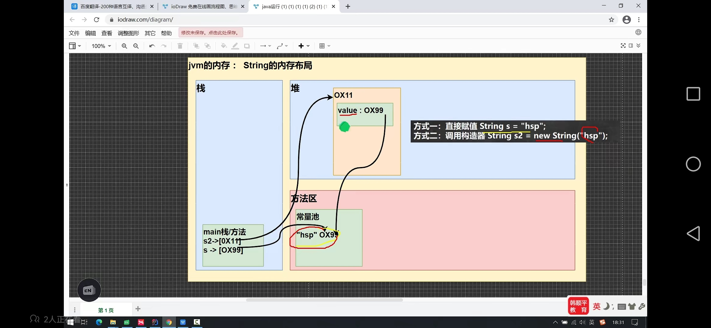

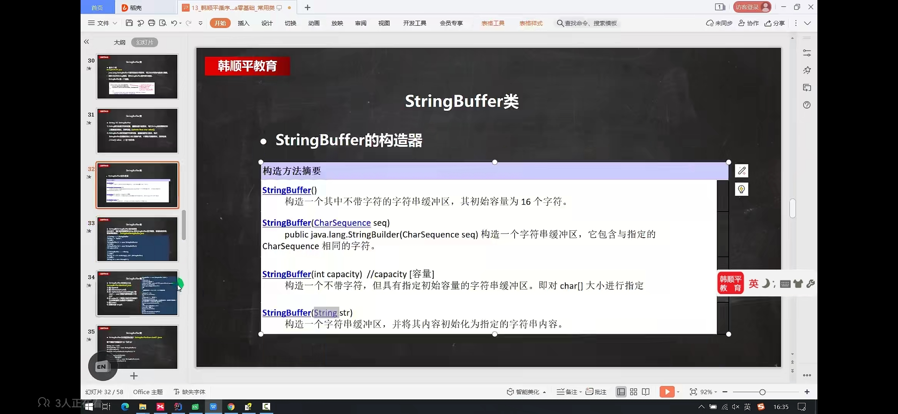


### StringBuffer类

1. 代表为可变字符序列，可以对字符串内容进行增删（很多方法与String类相同）
2. StringBufffer是一个容器
3. String Buffer是一个final类，不能被继承

  

#### StringBuffer的常用方法

1. 增append
2. 删delete（start，end）
3. 改replace(start,end,string)
4. 查indexof(寻找元素的索引号)
5. 插insert

### String Vs StringBuffer

1. String保存的是字符常量，里面的值不能更改，每次String类的更新实际上是跟新地址
2. StringBuffer保存的是字符常量，里面的值可以更改，每次跟新实际内容，当字符串长度越界时，会扩容


### StringBuilder

1. 一个可变字符序列，吃雷提供一个与StringBuffer兼容的API,但不包装同步（StringBuilder不是线程安全），该类被设计用作StringBuffer的一个简易替换，用在字符串缓冲区的单个线程使用的时候。如果可能，建议优先采用该类，因为大多数实现中，这个效率更快
2. 在StringBuilder上的主要操作是append和insert方法，可重载这些方法。以介绍任意类型的数据


### 对比

1. string：不可变字符序列。效率低，复用性高；
2. StringBuffer:可变字符序列，效率高，线程安全
3. StringBuilder:可变字符序列，效率最高，多线程存在风险

## Math类

1. abs绝对值
2. pow幂
3. ceil向上取整
4. floor向下取整
5. round四舍五入
6. sqrt开方
7. random求随机数(返回一个0<=x<1的一个随机数)
8. max求最大值
9. min求最小值


## Arrays类

1. toString返回数组字符串形式

2. sort排序

3. binarySearch通过二分搜索法进行查找，要求必须排好顺序

4. copyOf数组元素的复制(从arr 数组中复制arr.length个元素，如果复制元素大于原数组长度，就会这后位加多个null，如果长度不合理，则返回NegativeArraysizeException异常)

   integer [] mewArr = Arrays.copyOf(arr,arrl.length);

5. fill数组元素的填充,将原有元素都替换成填充元素;  

   ```java
   Integer[] num = new Integer[] (9,3,2);
   Arrays.fill(num,99);//都替换成99
   ```

6. equals比较两个个数组元素内容是否完成一致

   ```java
   boolen equaks = Arrays.equals(arr,arr2);
   ```

7. asList 将一组值，转换为list（集合）运行类型是Arrays的一个静态内部类

   ```java
   List<Integer> asList = Arrays.asList(2,3,4,5,6,1);
   System.out.println("asList=" + asList);
   ```

   

##   system类

1. exit(0)退出当前程序

2. arraycopy复制数组元素，比较适合底层调用，一般使用Arrays.copyOf完成数组

   ```java
   int [] src = {1,2,3};
   int [] dest = new int [3];
   System.arraycopy(src,0,dest,0,3);//被复制数组，下标，复制数组，下标，复制个数
   ```

3. currentTimeMilens:返回当前的时间与1970.1.1的毫秒数；

4. gc:运行垃圾回收机制


## BigInteger和BigDecimal介绍

1. BigInteger适合保存比较大的元素

   1. 在对BigInteger进行加减乘除需要使用对应的方法

   2. 可以创建对应的类进行对应的操作

      ```java
      BigInteger b1 = new BigInteger("4132523414125512512");//要字符串形式
      ```

      

   

2. BigDecimaL适合保存精度最高的浮点数

   1.   操作与BigInteger基本一致

   2. divide方法     除法的如果是无限小数，会出现异常，可以使用    BigDecimal.ROUND_CETLING

      ```java
      BigDecimal b2 = new BigDecimal(423423.4325345435436435236);
      b1.divide(b2,BigDecimal.ROUND_CETLING);
      ```

      ​                       

## 日期类

### 第一代日期类Date类

```java
Date d1 = new Date();//获取当前系统时间
SimpleDateFormat sdf = new SimpleDateFormat("yyy年MM月dd日 hh:mm:ss E");//日期格式化
Date d2 = new Date(423523);//通过毫秒数转成时间（从1970.1.1开始）

//可以一个格式化的String 转成Date
//此时输出依然是国外的形式
//使用的sdf格式需要和STring的格式一样否则抛出parsException
String s = "1995年01月01日 10:20:30 星期一";
Date pase = sdf.parse(s);
//sout("parse" + sdf.format(parse) );
```

1. 在Java.util和java.sql都存在Date类，sql与数据库有关


.jpg)


### 第二代日期类Calender类

1. Calender是抽象类，并且构造器是受保护的

2. 可以通过getInstanse()来获取实例

   ```java
   Calender c = Calender.getinstance();
   ```

   

3. 提供大量的方法和字段

4. Calender没有提供的对应的类，需要自己组合

5. 如果需要24小时进制，将Calender.HOUR改成Calender.HOUR_OF_DAY


### 第三代日期

1. 可变性：像日期和时间这样的类应该不可变的

2. 偏移性：DATe中的年份是从1900开始的，而月份都从0开始

3. 格式化：格式化只对Date有用，Calender则不行

4. 此外，它们也不是线程安全的，不能处理闰秒（每隔2天，多出一秒）

5. jdk8加入了LocalDate(只有年月日)，LocalTime(时分秒)，LocalDateTime（年月日时分秒）；

  
  
  ```java
  DatefoRmatter d = DatefoRmatter.ofPattren("yyy年MM月dd日 HH 小时 mm分钟 ss秒");
  //格式化
  String str =d.format(日期对象);
  ```
  
6. 提供大量的plus 和mius方法可以对当前时间进行加减

7. instant时间戳

   类似于Date

   提供一系列和Date类转换的方式

   instant->Date:

   Date date = Date.from(instant);

   Date->instant

   Instant instant = date.toInstant();

   ```java
   Instant now = Instant.now();//获取当前时间戳
   //sout(now);
   Date date = Date.from(now);//通过form可以转成Date
   //3.通过 date的toInstant()可以把date转成 Instant对象
   Instant instant = date .toInstant();
   ```


# 集合

### 集合框架体系

Java的集合类横夺，主要分为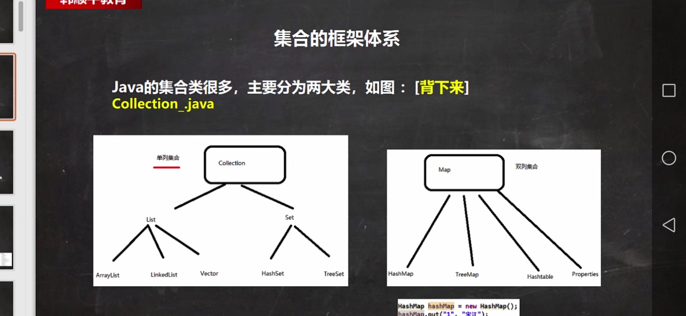


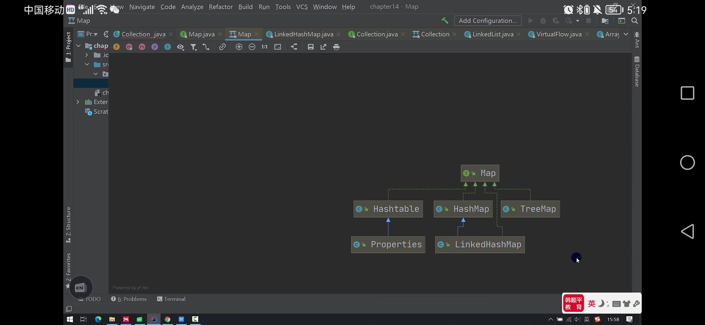


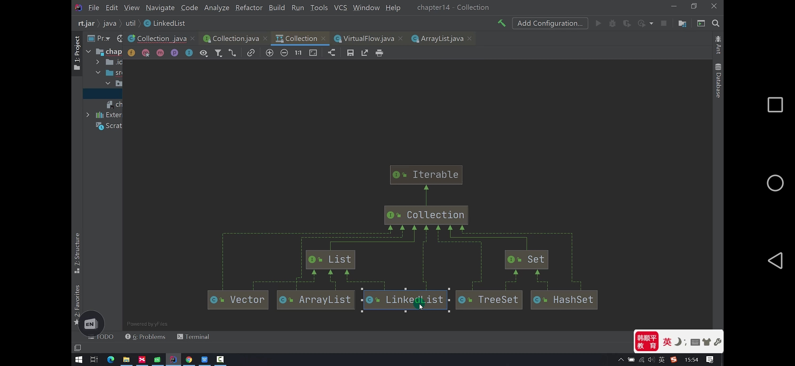

## collection接口和常用方法

1. collection实现子类可以存放多个元素，每个元素可以是Object
2. 有些collection的实现类，可以存放重复的元素，有些不可以
3. 有些collection的实现类，有些是有序，有些不是有序
4. collection接口没有直接的实现子类，是通过它的子接口set和List来实现的
5. 方法：add(); reverse(); sort();swap();shuffle();（随机打乱排序）max();min();frequency();(指定元素出现的次数);copy();replaceALL();
6. 存在比较器：匿名内部类（comparator）

### 迭代器

1. collection 接口遍历元素方式 -> 使用迭代器（iterator）
2. iterator对象称为迭代器，主要用于遍历 collection 集合中的元素
3. 所有实现了collection接口的集合类都有一个literator()方法，用以返回一个实现了literator接口的对象，即可以返回一个迭代器
4. literator 仅用于遍历集合，literator本身并不存在放对象
5. 迭代器的执行原理   literator iterator = coll.iterator(); 得到一个迭代器 
6. 1）Iterator对象称为迭代器，主要用于遍历Collection集合中的元素。
   2）所有实现了Collection接口的集合类都有一个iterator()方法，用以返回一个实现了Iterator接口的对象，即可以返回一个迭代器。
   3）Iterator仅用于遍历集合，Iterator本身并不存放对象。
   ————————————————
   原文链接：https://blog.csdn.net/sheng0113/article/details/122712947

#### 迭代器的方法

1. hasNext： 通过下移来实现获取元素 （链表）

2. next：返回下一个元素

3. 在调用iterator.next()方法之前必须要调用iterator.hasNext()进行检测，若不调用，且下一条记录无效（指针为空），直接调用it.next()会抛出NoSuchElementException异常

4. while 循环 itit 快捷键

5. ctrl + j   显示所有快捷键

6. ```java
     Iterator iterator = col.iterator();
      
   for(Object obj : col)
   {    System.out.println(obj);//增强for 底层为迭代器
       //快捷键 I
   }
   ```


### List接口的方法

1. ```java
   List list = new ArrayList();      
   list.add("jack");       list.add(100);//增加
   list.add(true);   
   System.out.println("list" + list);    
   list.remove(true);//删除    
   System.out.println("list" + list);
   System.out.println(list.contains("jack"));//查找元素      
   System.out.println(list.size());//2  获取元素个数  
System.out.println(list.isEmpty()); //是否为空  
   list.clear();//清空
   list.set();//修改元素
   // list.addAll(集合);  增加多个元素 
   //removeALl（集合）；删除多个元素
   //index为整型
   list.add(index,new obj);//放索引位置，元素
   list.lastindexof();//返回obj在当前集合中末次出现的位置
   list.set(index,new obj)//替换
   list.remove(index); //移除索引位置
   list.sublist(statindex,toindex);//返回从statindex到toindex
   ```
   
1. 可以通过序列号进行取出 List.get( index );


#### Arraylist（顺序表）的注意事项

1. peermits all elements ,including null,Arraylist ，可以加入 null 并且多个
2. ArrayList 是由数组来实现的数据存储的
3. Arraylist基本等同于vector ， 除了Arraylist是线程不安全（执行效率不高）看源码，在多线程的情况下，不建议使用ArrayList


#### vector的基本介绍

1. vector 底层是一个对象数组
2. vector是线程同步的，即线程安全，vector的操作方法带有synchroonized
3. 在开发者，需要线程同步安全时，考虑又vector
4. vector可以通过构造器改变capacityIncrement扩容大小

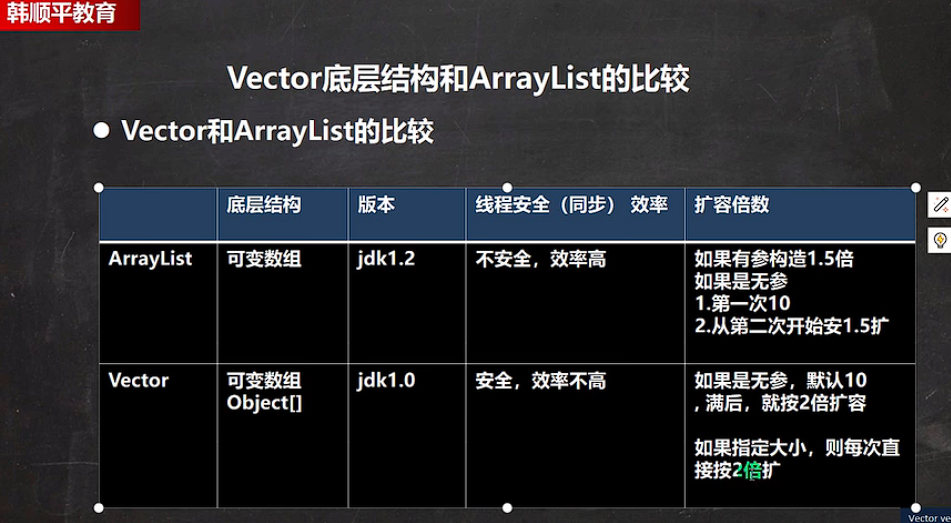

​                                                                                                                                                                                                                                                                                                                                                                                                                                                                                                                                                                                 

#### LinkList（双向链表）

1. LinkList 底层维护的是一个双向链表


### Set接口（哈希表和红黑树）

1. set接口的实现类对象，不能存放重复的元素，可以添加一个null
2. set的添加元素的顺序不是一致（下滑）的（通过地址（哈希值）），但是输出顺序是一致的


#### HashSet

1. hashset的底层是hashmap
2. 添加一个元素时，先得到hash值，通过运算会转成 索引值
3. 找到存储数据表table,看这个索引位置是否为已有元素
4. 如果没有，直接添加
5. 如果有，调用equals比较，如果相同，就放弃添加，否则反之
6. 在Java8中，如果一条链表元素个数超过TREEIFE_THRESHOLD(默认为8)，并且table的大小>=MIN_TREEIFY_CAPACITY(默认64)就会转换成红黑树；	


#### HashSet扩容

1. HashSet底层是HashMap,第一次添加时，table数组扩容到16，临界值（threshold）是16*加载因子（loadFactor）是0.75 = 12
2. 如果table数组达到临界值 12，就会扩容到16*2=32，新的临界值就是32*  * 0.73=24，依次类推
3. 在Java8中，如果一条链表的元素个数达到TREEIF_THRESHOLD(默认是8)，并且table的大小》= MIN_TREEIFY_CAPACITY(默认 64)就会变化成红黑树，否则采用数组扩容机制
4. 只要链表结点数 +哈希数组数大于 临界值就会进行扩容；


#### LinkedHashSet

1. 继承了HashSet,底层是一个LinkedHashMap,维护了一个hash表和双向链表
2. 每个结点都有pre和next属性
3. LinkedHashSet加入顺序和取出顺序一致


## Map接口

1. Map与Collection并列存在。用于保存具有映射关系的数据：Key-Value
2. Map中的key和value可以用任何引用类型的数据，会封装成HashMap$Node对象中
3. Map中的key不可以重复，原因于HashSet一样
4. Map中的Value可以被重复,当key相同时会被覆盖
5. Map中的key   ,value 都可以设为null，key只能存在一个null
6. 常用的String类可以作为Map中的Key
7. key和Value之间存在单向一对一关系，可以通过指定key找到value


### Map底层分析

1. K-V 最后是HashMap$Node node =newNode(hash,key,value,null)

2. k-v 为了方便程序员遍历，还会创建EntrySet集合，该集合存在的元素类型Entry,面向一个Entry对象就有k,v EntrySet<Entry<K,V>>  即 transient Set<Map,Entry<K,V>> entrySet;

3. entrySet中，定义的类型是Map.Entry,但实际上存放的还是HashMap$Node

4. Node实现了MapEntry接口，定义了一个内部类entry,可以理解为向上转型

5. 当把HashMap$Node对象存在entrySet就方便我们的遍历，因为Map,Entry提供了K getKey ,  V

    getValue


### Map接口的常用方法

1. map.put(key,value);   添加元素
2. map.remove(key,value)  || map.remove(key)；根据键删除映射关系
3. Object obj = map.get(key)；根据键获得值，返回的是object对象
4. map.size():获取元素个数;
5. map.isEmpty();判断是否为空，返回布尔值
6. cleae();  清空表
7. containsKey(); 查找键是否存在


### Map接口的六大遍历方式

1.

```java
//第一组：先取出所有的key  通过key找到对应的value
Set keyset = map.kepSet();
//(1)增强for
for(Object key : keyset){
    System.out.println(key + "-" + map.get(key));
}
//(2)迭代器
Iterator iterator = keyset.iterator();
while(iterator.hasNext()){
    Object key = iterator.next();
    System.out.println(key + "-" + map.get(key));
}

```

2. 

```java
//第二组：把所有的values取出
Collection values = map.values();
//这里可以使用所有的Collection使用的遍历方法
//（1）增强for
for(Object value : values){
    System.out.println(value);
}
//(2)迭代器
Iterator = iterator2 = values.iterator();
while(iterator2.hasNext()){
    Object value = iterator2.next();
    System.out.println(value);
}

```

3.

```java
//第三组：通过EntrySet 来获取 k-v
Set entrySet = map.entrySet();//EntrySet<Map.Entrey<k,v>>
//(1)增强for 
for(Object entry : entrySet){
    //将entry 转成 Map.Entry
    Map.Entry m = (Map.Entry)entry;
     System.out.println(m.getKey() + m.getValue());
}
//(2)迭代器
Iterator = iterator2 = entreySet.iterator();
while(iterator3.hasNext()){
    Object next = iterator3.next();
    Map.Entry m = (Map.Entry) entry;//向下转型调用
    //System.out.println(net.getclass);//编译类型
  System.out.println(m.getKey() + m.getValue())
}

```

1. containsKey:查找键是否存在
2. KeySet:获取所有键
3. entrySet :获取所有关系 k-v
4. values:获取所有的值


### HashMap

1. 没有实现同步，线程不安全，方法没有做同步互斥操作，没有synchronized
2. 扩容机制于HashSet相同


### Map接口实现类—Hashtable

1. 存放的元素是键值对： k-v
2. hashtable的键和值都不能为null,否则抛出NullPointerException
3. 使用方法和hashmap一样
4. hashtable是线程安全的，hashmap是线程不安全的
5. 底层有数组Hashtable$Entry[]初始化大小为11；
6. 临界值 threshold：8 = 11*0.75
7. 扩容    =  *2+1

### properties

1. 继承hashtable


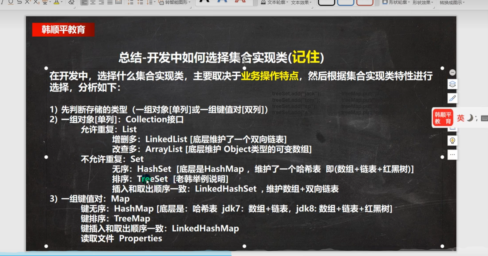


### TreeSet

1. 当我们使用无参构造器，创建TreeSet时，仍然是无序的
2. 使用TreeSet提供一个构造器，可以传入一个比较器（匿名内部类）底层是TreeMap
3.  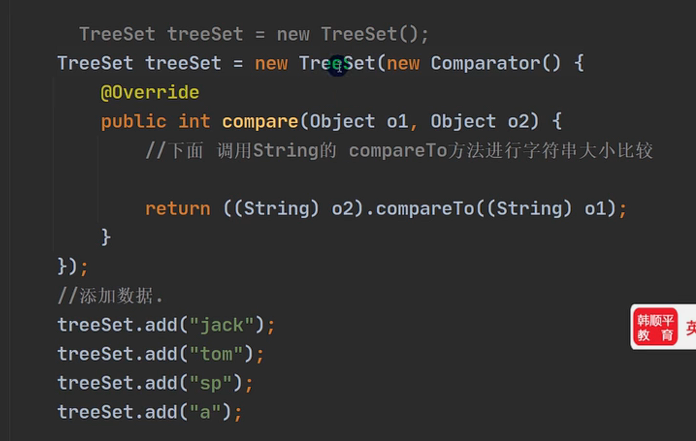


### TreeMap

1. 使用默认构造器，是无序的
2. 可以通过匿名内部类来牌序


# 泛型

### 介绍

1. 泛型又称参数类型，是jdk5出现的新的特征，解决数据类型的安全性问题
2. 在类声明或实列化时只要指定好需要的具体的类型即可
3. Java泛型可以保证如果程序在编译时没发出警告，运行时就不会产生ClassCastException异常。同时，代码更加简洁，健壮
4. 泛型的作用是：可以在类声明时通过一个标识表示类中某个属性的类型，或者是某个方法的返回值的类型，或者是参数类型
5. 泛型不具有继承性

### 声明

1. interface 接口 <T>{} 和 class 类<K,V>{}

2. 其中T,K,V不表示值，表示类型

3. 一般使用T,type的缩写

4. 可以接受泛型的子类型

5. 可以使用简写 List<A> list = new ArrayLise<>();省略运行类型的泛型

   

### 自定义泛型class 类名 <T,E,...>

1. 普通成员可以使用泛型

2. 使用泛型的数组，不能初始化(开辟空间无法确定)

3. 静态方法中不能使用类的泛型

4. 泛型类的类型，是在创建对象时确定的

5. 如果在创建对象时，没有指定，默认为object

6. 泛型接口的类型，在继承接口或者实现接口时确定

7. 泛型方法可以定义在普通类或者在泛型类

8. 当泛型方法被调用，类型会被确定

9. public void eat(E e){}不是方向方法，而是使用了泛型

10. public <T,R> void(T t,R r){}; 是泛型方法，声明了泛型标识符

    

### 泛型的通配

1. ```java
   public static void printCollection1(List<?> c){
      for(Object object : c){
       System.out.Println(object);
      }
   }
   //通配符，取出时，就是Objct
   ```

2. ```java
   // ? extends AA 表示上限，可以接受AA或者AA子类
   public static void printCollection2(List<? extends AA> c){
      for(Object object : c){
       System.out.Println(object);
      }
   }
   ```

3. ```java
   public static void printCollection3(List<? super AA> c){
      for(Object object : c){
       System.out.Println(object);
      }
   }
   //? super 子类类名AA：支持AA类以及AA类的父类，不限于直接父类，规定了泛型的下限
   ```

   

# JUnit测试类

1. 一个类有很多功能代码需要测试，为了测试，就需要写道main方法中
2. 如果有多个功能代码测试，就需要回来注销，切换麻烦
3. 如果可以直接运行一个方法，就方便很多，并且可以给相关信息-》JUnit
4. 使用方式 @Text + alt +Entet

# java绘图技术

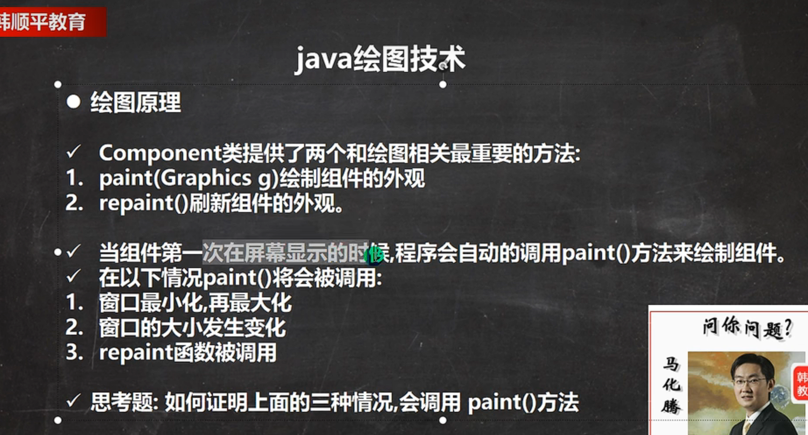

## JPanel类（画板）

画图状，就在面板画


## Graphics类(画笔)

1. 提供了很多画图方法
2. drawOval(画圆方法)（x,y,width,hight）(详细看文档)


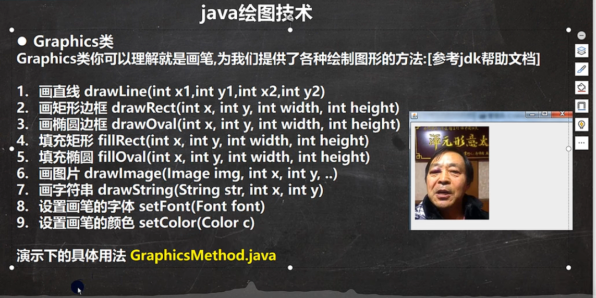

```java
Toolkit.getDefaultToolkit().getImage(URL url);
 Toolkit.getDefaultToolkit().getImage(Panel.class.getResource(""));
```

​    获取图片,图片一定要放在根目录下

##   JFrame类

用于嵌入面板


## keyListener接口

键盘监听器

1. keyTyped(KeyEvent e) 有字符输出时，会触发该方法
2. keyPressed(KeyEvent e) 当某个键按下时，会触发该方法
3. keyReleased(KeyEvent e) 当某个键松开时，会触发该方法


# Java事件处理机制

1. 事件源：一个产生事件的对象，比如按钮

2. 事件：承载事件源状态改变时的对象，如键盘事件

3. 事件监听器有多种接口，不同的事件监听器接口可以监听不同的事件，一个类可以实现多个监听接口

4. 这些接口在Java.awt.event 和javax.swing.event包中定义，

   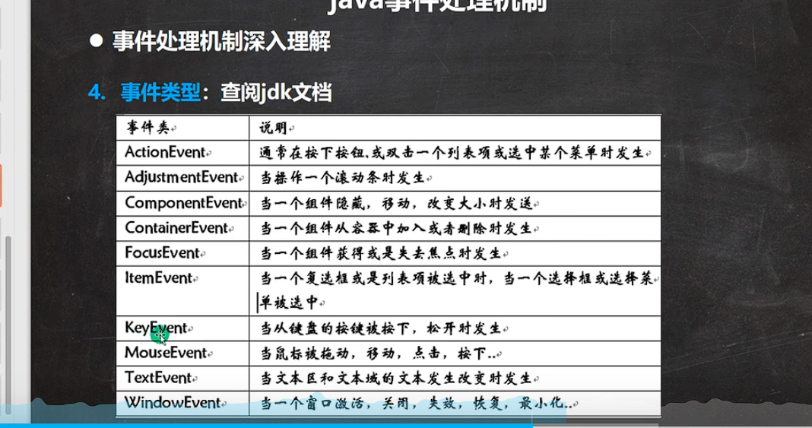


# 多线程

## 

单线程：同一时刻，只允许一个线程

多线程：同一时刻，可以执行多个线程

并发：同一时刻，多个任务交替进行

并行：同一个时刻，多个任务同时执行，多核cpu同时进行


## Thread类

1. 当一个类继承了thread类，该类就可以当线程使用

2. 重写run方法，写上自己的业务代码

3. run Thread类 实现了Runable 接口

4. slee(毫米);方法：进行 休眠

   

## runnable接口

1. java是单继承的，在某些情况下一个类可能已经继承了某个父类，这时在用继承Thread类方法来创建线程显然不可能了
2. Java设计者们提供了另外一个方式创建线程。就是通过实现Runnable接口创建线程
3. 可以通过Thread thread = newThread(object);使继承了runnable接口的object的类可以使用start();方法；底层使用了代理


## 线程方法

1. setName    设置线程名称，使之与参数name相同
2. getname     返回该线程的名称
3. start             执行线程
4. run               调用线程对象run方法
5. setPriority   更改线程优先级（MAX_PRIORITY,MIN_PRIORITY,NORM_PRIORITY）
6. getPriority   获得线程优先级
7. sleep             在指定毫秒内进行线程休眠
8. interrupt      中断休眠，一般用于中断休眠的线程       
9. yield                线程的礼让，让出cpu让其他线程执行，但礼让的时间不确定，所以不一定礼让成功（根据CPU内核态的紧张情况决定）
10. join               线程的插队。插队的线程一旦插队成功，则先执行插入的线程的所有任务        

## 用户线程和守护线程

1. 用户线程：也叫工作线程，当前线程的任务执行完或通知方式结束
2. 守护线程：一般是为工作线程服务，当所有的用户线程结束，守护线程自动结束
3. 常见的守护线程：垃圾回收机制

## 线程的七大状态

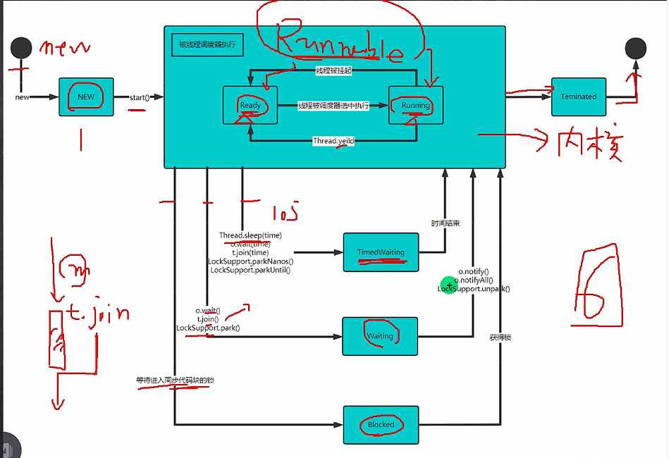

## 线程同步（synchronized）

1. 在多线程编程，一些敏感数据不允许被多个线程同时访问，此时就使用同步访问技术，保证数据在任何同一时刻，最多有一个线程访问，以保证数据的完整性
2. 线程同步，即当有一个线程在堆内存进行操作时，其他线程可以对内存地址进行操作，直到该线程完成操作，其他线程才能对该内存地址进行操作

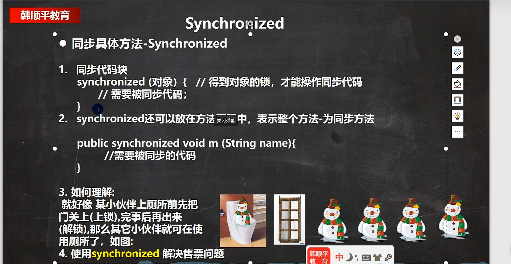

### 互斥锁

1. 在java语言中，引入了对象互斥锁的概念，来保证共享数据的完整性
2. 每个对象都对应于一个可称为“互斥锁”的标记，这个标记用来保证在任一时刻，只能有一个线程访问该对象
3. 关键字synchronized来于对象的互斥锁联系，当某个对象用synchronized修饰时，表明该对象在任一时刻只能由一个线程访问
4. 同步的局限性：导致程序的执行效率降低
5. 同步方法（非静态）的锁可以是this,也可以是其他的对象（要求同一个对象）
6. 同步方法（静态的）的锁为当前类本身


### 线程的死锁

多个线程占用了对方的锁资源，但不肯相让，导致了死锁，在线程需要避免死锁的情况

### 释放锁

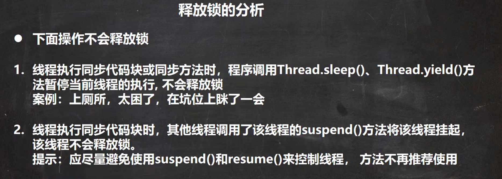

