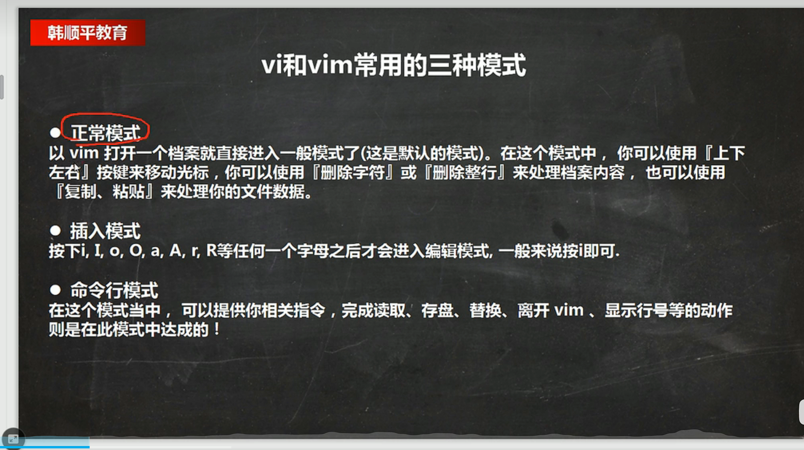
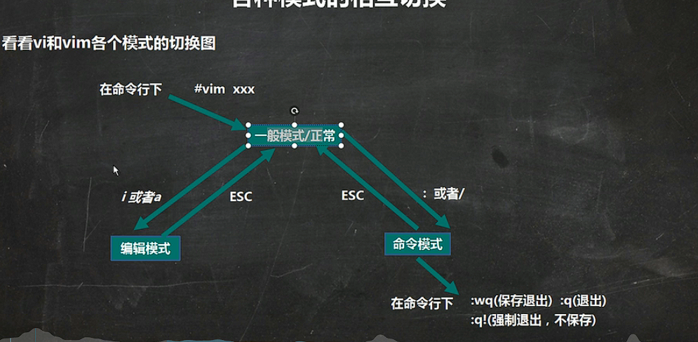
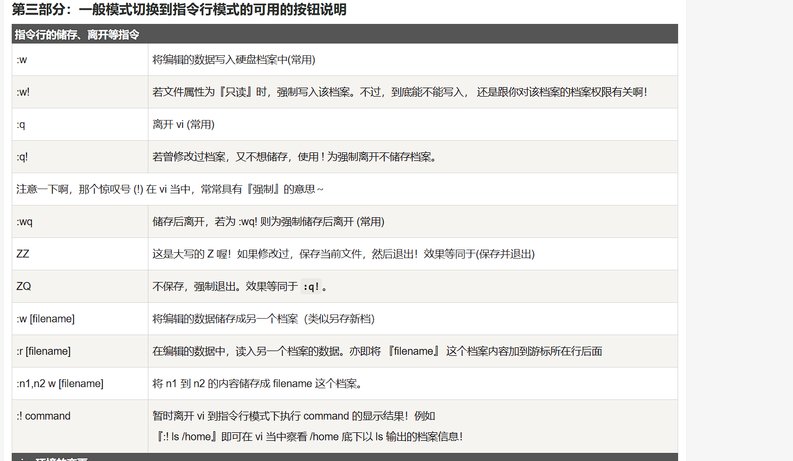
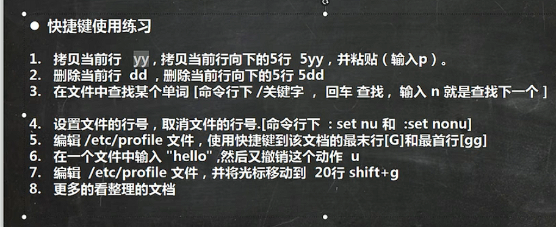
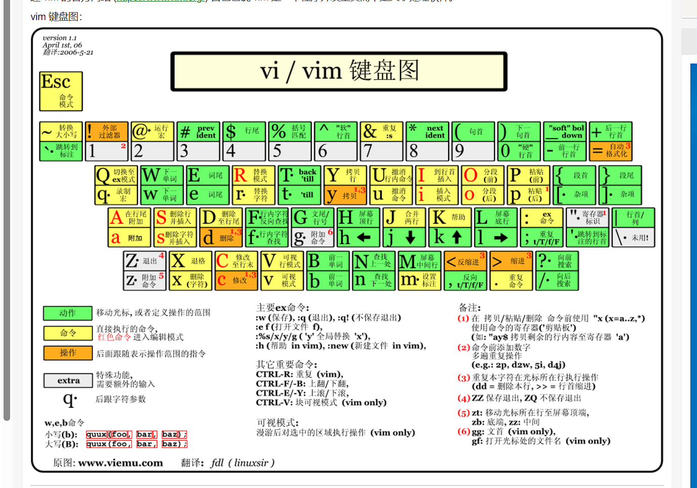

# 网络链接的三种模式

1. 桥接模式：虚拟系统可以和外部系统通讯，但是容易造成IP冲突

2. NAT模式，网络地址转换模式。虚拟系统可以和外部系统通讯（外网不可以连入内网），不造成IP冲突 

3. 主机模式：独立的系统

   

   

# vmtools

作用：与主机共享文件

1. 进入centos
2. 点击vm菜单的->install vmware tools
3. centos会出现一个vm安装包，xx.tar.gz
4. 拷贝/opt
5. 使用解压命令tar,得到一个安装文件 cd/opt[进入到opt目录]
6. tar-zxvf   (VM + tab) xx.tar.gz               [解压指令]
7. 进入vm解压的目录，/opt目录下
8. 安装 ./vmware-install.pl
9. 全部使用默认设置即可，就可以安装成功
10. 注意：安装vmtools 需要gcc
11. 在mnt文件夹存在共享文件

注意：widows和centos 就可以共享文件，但是在实际开发中，文件的上传下载使用的是远程方式完成的；

# 快照

等于存档（会占内存）

# 文件目录（N 表示一般不能使用）

├── bin -> usr/bin # 用于存放二进制命令
├── boot # 内核及引导系统程序所在的目录
├── dev # 所有设备文件的目录（如磁盘、光驱等）
├── etc # 配置文件默认路径、服务启动命令存放目录
├── home # 用户家目录，root用户为/root
├── lib -> usr/lib # 32位库文件存放目录
├── lib64 -> usr/lib64 # 64位库文件存放目录
├── media # 媒体文件存放目录
├── mnt # 临时挂载设备目录
├── opt # 自定义软件安装存放目录
├── proc # 进程及内核信息存放目录(N)
├── root # Root用户家目录
├── run # 系统运行时产生临时文件，存放目录
├── sbin -> usr/sbin # 系统管理命令存放目录
├── srv # 服务启动之后需要访问的数据目录(N)
├── sys # 系统使用目录（N）
├── tmp # 临时文件目录
├── usr # 系统命令和帮助文件目录(用户存放重要文件)

├── tmp#存放临时文件

├──media #识别的的设备（U盘）

├──usr/local#z这是另一个给主机所安装的目录

└── var # 存放内容易变的文件的目录

————————————————
版权声明：本文为CSDN博主「ha_lydms」的原创文章，遵循CC 4.0 BY-SA版权协议，转载请附上原文出处链接及本声明。
原文链接：https://blog.csdn.net/lydms/article/details/101368670

# 指令

pwd				查看当前工作目录
clear 			清除屏幕
cd ~			当前用户目录
cd /			根目录
cd -			上一次访问的目录
cd ..			上一级目录

Xshell的指令

ls                查看目录的当前文件

reboot       重启虚拟机

# 远程登录

1. linux服务器是开发小组共享的
2. 正式上线的项目运行在公网上
3. 因此程序要需要远程登录到Linux进行项目管理或者开发
4. ifconfig 指令查找IP地址
5. XFTP6 文件传输软件
6. Xshell远程登录Linux操作的软件
7. 乱码问题点击文件->默认会话属性->选项->编码->UTF->8

# vi 和 vim

## 模式切换

# 快捷键

# 关机和重启命令

1. shutdown  -h now  立刻关机
2. shutdown -h 1   1分钟后关机
3. shutdown -r now 现在重启计算机
4. halt  关机
5. reboot  重启
6. sync 把内存的数据同步到磁盘

# 用户的登录和注销

1. 登录时尽量少使用root,root的权限高；
2. su -用户名 可以切换管理员身份
3. logout 可以注销用户