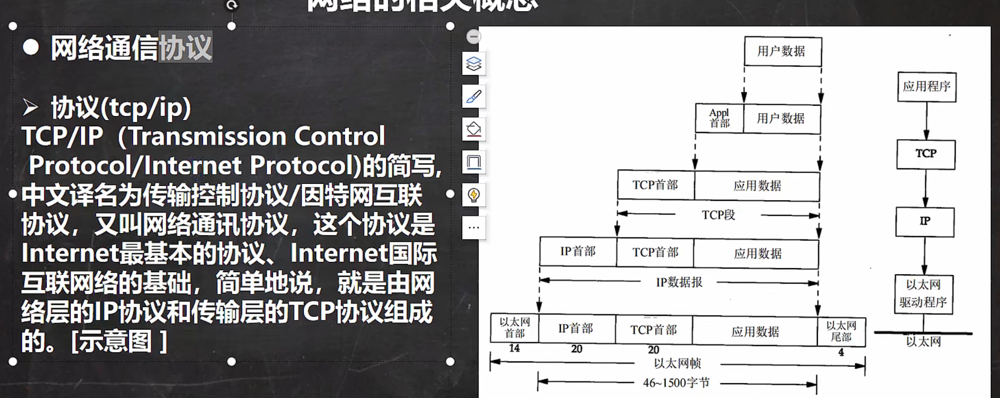

# 网络

## ip

## 域名

1. www.baidu.com
2. 好处：为了方便记忆，解决ip困难
3. 概念：将IP地址映射成域名

## 端口号

1. 概念：用于标识计算机上某个特点网络程序
2. 表示形式：以整形形式，范围0~65535
3. 0-1024已经被占用，比如 ssh 22,ftp 21,smtp 25,http 80
4. 常用的网络程序端口号：
   - ​      tomact :8080
   - ​      mysql:3306
   - ​     oracle:1521
   - ​      sqlserver:1433

