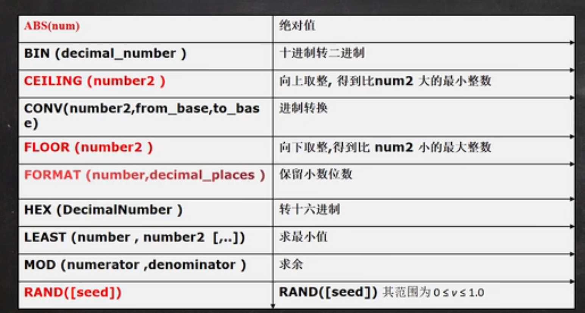

# 连到Mysql的指令

mysql -h 主机IP -P 端口 -u root -p 密码

net start mysql   开启数据库


# 数据库的三种结构

1. 所谓安装Mysql数据库，就是在主机安装一个数据库操作系统DBMS（database manage system）
2. 一个数据库可以创建多个表，以保存数据（信息）
3. 数据库管理系统（DBMS），数据库和表的关系


# SQL语句分类

- DDL: 数据定义语句【create 表，库...】
- DML:数据操作语句【增加 insert 修改 update  删除delete】
- DQL:数据查询语句【select】
- DCL:数据控制语句【管理数据库：比如用户权限 授权 grand  收回权限 revoke】


# 注释的快捷键

$$
shift + ctrl + c 加注释\\
shift + ctrl + r 取消注释
$$


# 库的操作


## 创建数据库


```mysql
CREATE DATABASE hsp CHARACTER SET utf-8 COLLATE utf8_ bin	
#创建hsp库并且使用utf-8 字符集校队utf_bin 区分大小写
#utf8_general_ci不区分
```

## 查看，删除数据库

```mysql
#显示数据库语句
SHOW DATABASES

#显示数据库创建语句
SHOW CREATE DATABASE db_name

#数据库删除语句
DROP DATABASE [IF EXISTS] db_name
```


## 备份和恢复数据库

```mysql
#备份数据库（注意：在DOS行）命令行
mysqldump -u 用户名 -p -B 数据库1 数据库2 ...数据库n > D:\\文件名.sql
#恢复数据库（注意：进入Mysql命令行再执行）
Source D:\\文件名.sql
#备份数据库的表
mysqldump -u 用户名 -p 数据库1 表2 ...表n > D:\\文件名.sql
```

# 表的管理

## 创建表

```mysql
CREATE TABLE table_name
(
field1 datatype,
field2 datatype,
field3 datatype
)

```

$$
character set 字符集\\
collate  校对规则\\
engine引擎\\
field: 指定列名 ...... datadype:指定类型（字段类型）\\
$$


## 数据类型


### 定义一个无符号

```mysql
CREATE TABLE table_name(
  id TINYINT UNSIGNED
);
#无符号的范围是0~x,
#如tinyint 0~255,有符号的在 -128 ~127
```


### 位类型

1. bit(m) m在1-64

2. 添加数据 范围按照你规定的位数来确定，比如m = 8表示一个字节0~255

3. 显示按照 bit

4. 查询时，仍然可以按照数来查询

   ```mysql
   CREATE TABLE table_name (
   num BIT(8)
   );
   INSERT INTO table_name VALUE(255); 
   ```

   

### 小数类型

1. FLOAT/DOUBLE[UNSIGNED]      float:单精度      double：双精度
2. DECIMAL[M,D] [INSIGNED]  
   - 可以支持更精确的小数位。M是小数位数（精度）的总数，D是小数点（标度）后面的位数
   - 如果D是0，则值没有小数点或分数部分。M最大65.D最大是30.如果D被省略默认为0，如果M被省略，默认是10.                              

```mysql
CREATE TABLE table_name(
    num1  FLOAT, 
    num2  DOUBLE, 
    num3  DECIMAL(20,20)

)
```

## 字符型

1. CHAR(size)固定长度字符串 最大255

2. VERCHAR(size) 0~655335字节，其中有3字节用来储存大小【utf8编码最大21844字符】

3. CHAR(SIZE),VARCHAR(SIZE)这个SIZE表示字符数，不是字节数根据选定的编码有关

4. CHAR（4）是定长（固定大小），即使只存在2个字符数，也分占用4个字符的内存

5. VARCHAR则是定长，不会找出空间的浪费。（本身需要预留1-3个字节来记录长度）

6. 查询速度CHAR>VARCHAR

    

## 日期类型的使用

```mysql
CREATE TABLE time_name(
  login_time TIMESTAMP
       NOT NULL DEFAULT CURRENT_TIMESTAMP
       ON UPDATE CURRENT_TIMESTAMP
);
#实现时间戳自动跟新时间
```


## 表的操作

1. 增加列

   ```mysql
   ALTER TABLE table_name
   ADD                    column datatype[DEFAULT expr]
                          [, column datatype]...
                          
                          AFTER column；
   ```

2. 修改列

   ```mysql
   ALTER TABLE table_name
   MODIFY           column datatype[DEFAULT expr]
                          [, column datatype]...
                          ;
   ```

3. 删除列

   ```mysql
   ALTER TABLE table_name
   DROP  column;
     DESC 表名； --可以查看表的结构
   ```

4. 修改表名

   ```mysql
   RENAME TABLE table_name TO new_table_name
   ```

5. 修改字符集

   ```mysql 
   ALTER TABLE	table_name CHARCTER SET new_character_set
   ```

6. 修改列名

   ```mysql
   ALTER TABLE emplyee
             CHANGE `name` `user_name` VARCHAR(4)
             #将列名 name 改成user_name
   ```

   ​     

# 数据库的CRUD语句

## insert: (添加数据)

```mysql
INSERT INTO table_name(column...) VALUES (data...) 
```

1. 插入的数据应与字段的数据类型相同，比如吧‘abc'添加到int类型会错误
2. 数据长度应在列的规定范围内，例如：不能将一个长度为80的字符串加入到长度为40的列中
3. 在values中列出的数据位置必须与被加入的列的排列位置相对应
4. 字符和日期类型数据因包含在单引号中
5. 列可以插入空值（前提是允许）
6. insert into tab_name(列名)  values  ( ) ()形式增加多条记录
7. 如果表中的所有字段添加数据，可以不写前面的字段名称
8. 默认值的使用，当不给某个字段值时，如果有默认值就会添加，否则报错。


## update：（修改，更新数据）

1. ```mysql
   UPDATE table_name SET column1 = update,column2 = update WHERE row_name = (row);
   ```

2. WHERE:该语句可以指定其中元素进行修改（如果不添加where则为全部元素进行修改）

3. SET:指定要修改所有的列

## delete:(删除数据)

```mysql
DELETE FROM table_name WHERE ROW_name = "name";
#选择该表的该行进行删除

DELETE * FROM table_name 
#删除表中所有的数据
```

1. 使用delete只能删除表的记录，不能删除表本身，可以通过 drop table table_name; 进行删除


## select：（选择于语句）

```mysql
SELECT [DISTINCT] * [COLUMN...] FROM table_name;
```

1. select 指定查询那一列的数据
2. column:列名
3. *：代表查所有列
4. From指定查询哪张表
5. DISTINCT 可选，指显示结果，是否去掉重复数据

```mysql
#查询表中所有学生信息
SELECT * FROM student;
#查询表中所有学生姓名和对应的英语成绩
SELECT 'name',english FROM student;
#过滤表中重复数据distinct 
SELECT english FROM student;
#其中当表中选择的字段都相同时，distinct 才会生效 
```

- 使用表达式对查询的列进行运算

  ```mysql
  SELECT * {COLUMN ..} FROM table_name;
  ```

- 在select语句中可以使用as语句

  ```mysql
  SELECT column_name AS 别名 FROM 表名 
  ```

  

```mysql
#统计每个学生的总分
SELECT 'name',(chinese+english+math) FROM student;
#在所有学生总分加十分且取别名的情况
SELECT 'name' AS '名字',(chinese+english+math+10) AS total_score FROM student;
```

### where语句运算符号


```mysql
#查询总分大于90的
SELECT * FROM student WHERE (chinese+english+math)>90;
#查询总分大于200分且姓韩的同学
#韩%表示，名字所有以韩开头的同学
SELECT * FROM student WHERE total_sore>200 AND 'name' LIKE '韩%'
```

1. betwwen and 该语句为闭区间
2. 

### 使用 order by 子句进行排序查询

1. OREDER BY 指定排序序列，排序的列既可以是表中的列名，也可以是select语句后指定的列名
2. ASC升序（默认），DESC 降序
3. ORDER BY子句应该位于SELECT 语句的结尾

```mysql
SELECT * FROM student ORDER BY math;
#对数学成绩排序后输出【降序】
SELECT `name`, (chinese+math+english) AS total_name ORDER BY total_sore DESC
#对总分进行降序 并且使用别名 total_sore


```

### 分组顺序


# 函数

## 合计/统计函数  

#### COUNT 返回行的总数

```mysql
#统计一个班级有多沙学生？
SELECT COUNT(*) FROM studet;
#统计数学成绩大于90的学生有多少个
SELECT COUNT(*) FROM student WHERE (math +chinese +english) >250
#count(*)和count(列)的区别
#count(*)返回满足条件的记录的行数
#count(列)：统计满足条件的某列有多少个，但是会排除NULL；
```

#### SUM和AVG,MAX,MIN

```mysql
#统计一个班级的数学总成绩
SELECT SUM(math) FROM student;
#统计一个班级各科的总成绩
SELECT SUM(math),SUM(chinese),SuM(english) FROM student;
#求一个班的数学平均分
SELECT AVG(math) FROM student;
#求班级的最高分和最低分
SELECT MAX(math + chinese +english),MIN(math+chinese +english)
  FROM student;
```

#### group by子句

```mysql
#GROUP BY 用于限制分组结果
SELECT AVG(sal) MAX(sal),deptno ,job
   FROM emp GROUP BY deptno , job;
```


```mysql
#having子句来修饰过滤条件，与where相似
SELECT AVG(sal) AS avg_sal , deptmo
  FROM emp GROUP BY depnto HAVING avg_sal < 2000;
```


## 字符串函数


```mysql
#CHARSET(str) 返回字符串字符集
SELECT CHARSET(ename) FROM emp;
#CONCAT(String[]..) 连接字串，将多个列拼接成一列
SELECT CONCAT(ename, '工作是' ,job) FROM emp;
#INSTR(string,subtring) 返回subtring 在 string 中出现的位置，没有返回0
#DUAL 亚元表 系统表
SELECT INSTR('hangping', 'ping') FROM DUAL;
#返回 5
#UCASE(string) 转化为大写
SELECT UCASE(ename) FROM emp;
#LCASE(string) 转化为小写

#从string左边取length个字符
SELECT LEFT(ename,2) FROM emp;
#从右边则为 RIGHT (string,length)

#string长度【字节】
SELECT LENGTH(string) FROM emp;
#将列中字符串进行代替
SELECT ename,REPLACE(job,'MANAGER','经理') FROM emp;
#将job 中MANAGER 代替成 经理
#SUBSTRSING(str,position,[length])
#从position 开始取length 个的字符
SELECT SUBSTRING(ename,1,2) FROM emp;

#LTRIM(str) 去前端空格
#RTRIM(str) 去后端空格
#TRIM(str) 去两端空格
```

## 数学函数



```mysql
 #将数取绝对值
SELECT ABS(-10) FROM DUAL;
#将十进制转为二进制
SELECT BIN(10) FROM DUAL;
#进行进制转换
#将十进制的8转化为二进制
SELECT CONV(8,10,2) FROM DUAL;
#向上取整
SELECT CEILING(1.1) FROM DUAL; --2
```

## 时间函数


```mysql
SELECT UNIX_TIMESTAMP() FROM DUAL;
#返回1970-1-1到现在的秒数

#FROM_UNIXTIME() 可以在把一个 unix_timestamp秒数转化为指定格式
SELECT FROM_UNIXTIME(532542362,'%Y-%m-%d &H:%i:%s') FROM DUAL;
```


## 加密函数


## 流程控制函数


# mysql多表查询

##   分页查询

1. 按雇员的id号升序取出，每页显示3条记录。

2. 基本语法
   $$
   SELECT ... LIMIT \ START,ROWS
   $$
   

表示start+1行开始取，取出rows行，start从0开始算


## 笛卡尔集

在默认情况下，两个表中，取出一个表中的每一行于另一个表的每一行进行自由组合产生的组合表


## 自链接

1. 将同一张表当作两张表使用


## 子查询

1. 子查询是指嵌入在其他sql语句中得select语句，也叫嵌套查询

2. 单行子查询是指返回一行数据的子查询语句

   ```mysql
    #查询smith的部门
    SELECT * FROM emp WHERE deptno = (
          SELECT deptno FROM emp
             WHERE ename = "smith";
    )
   ```

   

3. 多行子查询指返回多行数据的子查询，使用关键字  <font color = "red"> in </font>

   ```mysql
   #如何查询和部门10的工作相同的雇员的名字，岗位，工资，部门号，但是不含10自己
   SELECT ename，job,sal,deptno FROM emp 
        WHERE job IN(
        SELECT DISTING job
            FROM emp
            WHERE deptno = 10
        
        )AND deptno <> 10
   ```

4. all和any操作符

   ```mysql
   #显示工资比部门30的所有员工的工资高的员工的姓名，工资和部门号
   SELECT ename ,sal,denptno
         FROM emp
         WHERE sal>ALL(
             SELECT sal
              FROM emp
             WHERE deptno = 30
         
         )
   #显示工资比部门为30的其中一个员工高的姓名工资和部门号
   SELECT ename ,sal,denptno
         FROM emp
         WHERE sal> ANY(
             SELECT sal
              FROM emp
             WHERE deptno = 30
         
         )
     
   ```

5. 多列子查询

   ```mysql
   #查询与Smith的部门和岗位完全相同的所有雇员且不包括自己
   SELECT * FROM emp
              WHERE (deptno,job)=(
              SELECT deptno,job
                  FROM emp
                  WHERE ename = 'smith'
              )AND ename != 'smith'
   
   ```


## 表复制和去重

```mysql
#将emp表的记录复制到my_table
INSERT INTO my_table
         (id,name)
         SELECT id,name FROM emp;
    
#自我复制
INSERT INTO my_table 
       SELECT * FROM my_table;
  
#将emp表的结构复制到my_table
CREATE TABLE my_table LIKE emp;

/*
1.去重
2.先创建一个临时表my_tmp,该表的结构和my_table一样
3.把my_table的记录，通过distinct 关键字处理后把记录复制到my_tmp
4.清除my_table记录
5.my_tmp表记录复制到my_table,后删除my_tmp
*/

CREATE TABLE my_tmp LIKE my_table;
INSERT INTO my_tmp
      SELECT DISTINCT * FROM my_table;
DELETE FROM my_table;
INSERT INTO my_table SELECT * FROM my_tmp;
DROP TABLE my_tmp;
```


## 合并查询

1. 有时在实际操作中，为了合并多个select语句的结果，可以使用集合操作符号

2. union all ：该操作符用于取得两个结果集的并集。当使用该操作符时，不能取消重复行(只使用UNION 可以去重)

   ```mysql
   SELECT column1 .. FROM table_ WHERE column1 > ? UNION ALL
   SELECT column1 .. FROM table_ WHERE column2 = ?;
   ```


## 外连接

1.  左外连接（如果左侧的表完成显示我们就说是左外连接）

   ```mysql
   SELECT .. FROM tanle_1 LEFT JOIN tabele_2 ON (条件)
   
   ```

   

2. 右外连接

   ```mysql
   SELECT .. FROM tanle_1 RIGHT JOIN tabele_2 ON (条件)
   ```

   

# mysql 约束

约束用于确保数据库数据满足特定的商业规则，在mysql中包括 not null,unique,primary,key和check 五种。

## 主键

1. primary key(主键)

2. 用于唯一的标示表行的数据，当定义主键约束后，该列不能重复

   ```mysql
   FIELd_name FIELD_type primary key；
   ```

   

3. 主键不能重复且不能为null,但可以是复合主键(符合主键是将几个字段捆绑，当这些字段都相同时就重复错误)

   ```mysql
   CREATE TABLE table_name(
        id INT,
        `name` VARCHAR(32),
         PRIMARY KEY(id,`name`)
   );
   ```

   

## not null （非空）

如果在列上定义了not null，那么当插入数据时，必须为列提供数据

```mysql
FIELD_name FIELD_type NOT NULL;
```


## unique(唯一)

当定义了唯一的约束后，该列值是不能重复的(NULL可以重复)

```mysql
FIELD_name FIELD_type UNIQUE;
```


## foreign key(外键)

用于定义表和表之间的关系：外键约束要定于在从表上，主表则必须具有主键约束或是unique约束，当定义外键约束后，要求外键列数据在主表的主键列存在或是为null

```mysql
FOREIGN KEY (本表字段名) REFERENCES 主表明(主键名或unique字段名);
```


1. 外键指向的表的字段，要求是主键（primary key）或者是unique
2. 表的类型是innodb，这样的表才支持外键
3. 外键字段的类型要和主键字段的类型一致（长度可以不同）
4. 外键字段的值，必须在主键字段中出现过，或者为null
5. 一旦建立主外键的关系，数据不能随意删除


## check

1. 用于强制行数数据必须满足条件，假定在sal列定义了check约束，并在sal列值在1000-2000之间如果不再1000-2000之间就会提示出错
2. Oracle和sql server均支持check，但是mysql5.7目前还不支持check,只做语法校验，但不会生效

```mysql
CREATE TABLE student(
     `name` VARCHAR(32);
      sex VARCHAR(32) CHECK (sex IN ('man','woman'))
);
```


# mysql自增长

​        像某张表中，存在一个id列中，我们希望再添加记录的时候，该列从1开始，自动增长

```mysql
FIELD INT PRIMArY KEY AUTO INCREAMENT;
```

1. 一般来说，自增长配合主键一起使用

2. 也可以配合unique一起使用

3. 自增长修饰的字段一般为整形

4. 自增长可以改变初始值（一般从1开始）

5. ```mysql
   ALTEER TABLE table_ AUTO_INCRTAMENT;
   #修改初始值
   ```


# mysql索引

1. 索引的本质是二叉搜收树
2. 主键索引，主键自动的为主索引
3. 唯一索引（unique）
4. 普通索引（index）
5. 全文索引(fulltext)[一般开发不使用这个，一般使用solr,ElasticSearch框架]

```mysql
#添加索引
#唯一索引（当字段补重复的时候使用）
CREATE UNIQUE INDEX id_index ON table_name(field);
#普通索引
CREATE INDEX id_index ON table_name(field);
ALTER TABLE table_name ADD INDEX id_index (field);

#添加主键
ALTER TABLE table_name ADD PRIMARY KEY(field);

#删除索引
DROP INDEX id_index ON table_name;

#删除主键
ALTER TABLE table_name DROP PRIMARY KEY;

#查询索引
SHOW INDEX FROM table_name;
SHOW INDEXES FROM table_name;
SHOW KEYS FROM table_name;
DESC table_name;
```


## 索引规则

1. 比较频繁的作为查询条件字段应该创建索引
2. 唯一性太差的字段不适合单独创建索引，即使频繁作为查询条件
3. 更新非常频繁的字段不适合查看索引
4. 不会出现再WHERE子句中字段不该创建索引


# mysql事务

事务用于保证数据的一致性，它由一组相关的dml语句组成，该组成dml语句组成,该组成的dml语句要么全部成

功，要么全部失败。

```mysql
start transaction --开始一个事务
set autocommit = off --开始一个事务
savepoint   --设置保存点
rollback to --回退事务
rollback --回退全部事务
commit --提交事务，所有操作生效，不能回退
```

1. 如果不开始事务，默认情况下，dml操作是自动开启的
2. 如果开启一个事务，但是没有创建保存点，你可以执行rollback,默认回到事务的起点。
3. mysql的事务机制是innodb存储引擎

 


## 事务的隔离级别

1. 多个连接开启各自事务操作数据库中数据时，数据库系统要负责隔离操作，以保证各个链接在获取数据是的准确性
2. 不考虑隔离性：脏读，不可重复读，幻读
3. 脏读（dirty read）:当一个事务读取另一个事务尚未提交的蟹盖时，产生脏读
4. 不可重复读（nonrepeatable read）：同一查询在同一事务中多次进行，由于其他提交事务所做的修改或删除，每次返回不同的结果集，此时发生不可重复读
5. 幻读（phantom read ）:同一查询在同一事务中多次进行，由于其他提交事务所做的插入操作，每次返回不同的结果集，此时发生幻读
6. 加锁读：当一个事务进行插入删除等操作时，另一个事务不能进行任何操作，会进入阻塞状态


```mysql
#查看当前会话隔离级别
SELECT @@transaction_isolation;


#查看系统的隔离级别
SELECT @@global_transaction_isolation;

#设置隔离级别
SET SESSION TRANSACTION ISOLATION LEVEL READ UNCOMMITTED;
```


# mysql存储引擎和表类型

1. mysql的表类型是由存储引擎决定的，主要包括MyLSAM,innoDB,Memory等

2. mysql数据表主要支持六种类型，分别是CSV，Memory,ARCHIVE,MRG_MYISAM,MYISAM,innoBDB

3. 这六种又分为两类，一类是“事务安全型”，比如innoDB;其余都是‘’非事务安全型“

4. ```mysql
   #查看所有存储引擎
   show engine;
   ```

   


# 视图

1. 视图是一个虚拟表，是基于真实表建立的

2. 基表和视图的数据是互相影响

3. ```mysql
   create view 视图名 as select语句
   alter view 视图名 as select语句
   show create view 视图名
   drop view 视图名1，视图名2
   ```

   


# mysql管理

user表中重要字段的声明：

1. host:允许登录的“位置”，localhost表示该用户只允许本机登录，也可以指定ip地址

2. user:用户名

3. authentication_string:密码，是通过mysql的password()函数加密之后的密码

4. ```mysql
   SELECT * FROM mysql.user
   #查询用户
   ```

   


## 创建

使用`CREATE USER`语句创建用户，并指定用户名和密码。例如，创建一个名为"myuser"的用户，并设置密码为"mypassword"，可以执行以下命令：

```mysql
CREATE USER 'myuser'@'localhost' IDENTIFIED BY 'mypassword';


#修改密码
SET PASSWORD = PASSWORD(‘新密码’);
SET PASSWORD 'user'@'host' = PASSWORD('新密码');
```


## 授权

1. 授予用户适当的权限。创建用户后，默认情况下用户没有任何权限。您可以使用`GRANT`语句为用户授予所需的权限。例如，授予用户在名为"mydatabase"的数据库上的所有权限，可以执行以下命令：

   ```mysql
   GRANT ALL PRIVILEGES ON mydatabase.* TO 'myuser'@'localhost';
   ```

   在上面的示例中，'mydatabase'是数据库名，'myuser'是要授予权限的用户名，'localhost'表示该用户只能从本地主机连接到MySQL服务器。

2. 最后，使用`FLUSH PRIVILEGES`语句刷新权限，以使更改生效：

   ```mysql
   FLUSH PRIVILEGES;
   ```


## 回收权限

```mysql
revoke 权限列表 on 库.对象名 from 'user'@'host'
```


## 删除用户

```mysql
DROP USER user_name
```


# jdbc

jdbc是Java提供一套用于数据库操作的接口API

## 编写步骤

要通过Java使用 JDBC 连接到 MySQL 数据库，你需要遵循以下步骤：

1. 确保你已经安装了 MySQL 数据库，并且已经下载并安装了 MySQL Connector/J 驱动程序。你可以从 MySQL 官方网站上下载该驱动程序。
2. 在你的 Java 项目中，导入 `java.sql` 和 `com.mysql.jdbc` 包。
3. 在你的代码中，使用以下代码加载 MySQL 驱动程序：

```java
Class.forName("com.mysql.cj.jdbc.Driver");
```

1. 创建一个连接字符串，指定数据库的 URL、用户名和密码：

```java
String url = "jdbc:mysql://localhost:3306/your_database_name";
String username = "your_username";
String password = "your_password";
```

请注意，`localhost` 是 MySQL 服务器的主机名，`3306` 是 MySQL 服务器的默认端口号，`your_database_name` 是你要连接的数据库的名称，`your_username` 和 `your_password` 是你的 MySQL 用户名和密码。

1. 使用 `DriverManager.getConnection()` 方法创建与数据库的连接：

```java
Connection connection = DriverManager.getConnection(url, username, password);
```

1. 现在，你可以使用 `connection` 对象执行 SQL 查询和更新。例如，你可以创建一个 `Statement` 对象并使用它来执行查询：

```java
Statement statement = connection.createStatement();
ResultSet resultSet = statement.executeQuery("SELECT * FROM your_table_name");
while (resultSet.next()) {
    // 处理结果集
}
```

1. 在使用完数据库连接后，记得关闭连接和相关资源：

```java
resultSet.close();
statement.close();
connection.close();
```

这是一个基本的示例，用于通过 JDBC 连接到 MySQL 数据库。你可以根据自己的需求进一步扩展和优化代码。


## statement

1. statement对象用于执行静态SQL语句并返回其生成的结果的对象
2. 在连接建立后，需要对数据库进行访问，执行命名或是SQL语句，可以通过 statement，prepared statement，Callablestatement
3. statement对象执行SQL语句，存在SQL注入风险
4. SQL注入是利用某些系统没有对用户输入的数据进行充分的检查，而在用户输入数据中注入非法的SQL语句段或命令，恶意攻击数据库
5. 要防范SQL注入，只要PreparedStatement取代Statement就可以了
6. 

## 预处理查询

PreparedStatement

1. PreparedStatement执行的SQL语句中的参数用问号（？）来表示，调用PreparedStatement对象的setXxx()方法来设置这些参数的索引，第二个设置的SQL语句的参数的值
2. executeQuery,返回ResultSet对象，进行查询操作
3. executeUpdate();执行增删改，更新


## 事务

1. JDBC程序中当一个Connection对象创建时，默认情况下是自动提交事务：每次执行一个SQL语句时，如果执行成功，就会向数据库自动提交，而不能回滚
2. JDBC程序中为了让多个SQL语句作为一个整体执行，需要使用事务
3. 调用Connection的setAutoCommit(false)可以取消自动提交事务
4. 在所有的SQL语句都成功执行后可以使用commit提交事务
5. 在其中某个操作失败或出现异常时，调用rollback进行回滚事务


## 批处理

1. 当需要成插入或者更新记录时。可以用Java的批量更新机制，这一机制允许多条语句一次性提交给数据库批量处理

2. 方法：

   1. addBatch():添加需要批量处理的SQL语句和参数
   2. executeBatch() 执行批量处理语句
   3. clearBatch() 清空批量处理包的语句

3. JDBC连接到MysQL时，如果要使用批处理，请在url中家参数 

   ```
   ?rewriteBatchStatement=true
   ```


## 连接池

### 传统连接

1. 传统连接耗费时间长，频繁占用资源，容易崩溃
2. 每一次数据库连接断开，异常未关闭，导致数据库内存泄露，最终导致重启数据库
3. 连接数量不能过多


### 数据库连接池

1. 预先在缓冲池中放入一定数量的连接，当需要建立数据库连接时，只需从“缓冲池”中取出一个，使用完毕之后放回去
2. 数据库连接池负责分配，管理和释放数据库连接，它允许应用程序重复使用一个现有的数据库连接，而不是重新建立一个
3. 当应用程序向连接池请求的连接数超过最大连接数量，这些请求将加入到等待队列中


### 连接池种类

1. JDBC的数据库连接池使用 javax.sql.DataSourse 来表示，DataSource只是一个接口，该接口通常由第三方提供实现
2. C3P0数据库连接池，速度比较慢，稳定性强
3. DBCP数据库连接池，速度较快，稳定性弱
4. Proxool数据库连接池，有监控连接池状态的功能
5. Bone CP，速度快
6. Druid(德鲁伊)数据库连接池（流行使用）


### C3P0

 @Test
    //C3P0 第一种连接方式 ，用户密码，driver url 在程序中方设定
    public void C3p01 () throws IOException, PropertyVetoException, SQLException {

```java
 
 @Test
    //C3P0 第一种连接方式 ，用户密码，driver url 在程序中方设定
    public void C3p01 () throws IOException, PropertyVetoException, SQLException {

ComboPooledDataSource comboPooledDataSource = new ComboPooledDataSource();
    Properties properties = new Properties();
    properties.load(new FileInputStream("src\\mysql.properties"));
    String user = properties.getProperty("user");
    String password = properties.getProperty("password");
    String url = properties.getProperty("url");
    String driver = properties.getProperty("driver");
 
    // 2 配置连接数据库的信息
    comboPooledDataSource.setJdbcUrl(url);
    comboPooledDataSource.setUser(user);
    comboPooledDataSource.setPassword(password);
    comboPooledDataSource.setDriverClass(driver);
 
    // 初始化
    comboPooledDataSource.setInitialPoolSize(10);//初始化连接数
    comboPooledDataSource.setMaxPoolSize(50);//设置最大连接数
    // 3  获得链接
 
    Connection connection = comboPooledDataSource.getConnection();
 
    System.out.println("连接成功");
    connection.close();
    }
```


#### 配置文件

```xml
<c3p0-config>
    <!--使用默认的配置读取数据库连接池对象 -->
        <named-config name="小鲨鱼">
            <!--加载驱动的Driver路径-->
        <property name="driverClass">com.mysql.jdbc.Driver</property>
<!--指定连接数据库-->
        <property name="jdbcUrl">jdbc:mysql://localhost:3306/db_02</property>
<!--连接数据库的用户-->
        <property name="user">root</property>
<!--对应的密码-->
        <property name="password">123456</property>

        <!-- 连接池参数 -->
        <!--初始化申请的连接数量-->
        <property name="initialPoolSize">5</property>
<!--每次增长链接的数-->
        <property name="acquireIncrement">5</property>
        <!--最大的连接数量-->
        <property name="maxPoolSize">10</property>
    <!--最小连接数-->
        <property name="minPoolSize">5</property>
        <!--超时时间-->
        <property name="checkoutTimeout">3000</property>
<!--每个连接对象可连接的最多的命令对象数-->
        <property name="maxStatementsPerConnection">2</property>
       </named-config>
</c3p0-config>

```

————————————————
版权声明：本文为CSDN博主「一直在进步的派大星」的原创文章，遵循CC 4.0 BY-SA版权协议，转载请附上原文出处链接及本声明。
原文链接：https://blog.csdn.net/jmgufss/article/details/12665882

```java
 public void C3P02 () throws SQLException {
        ComboPooledDataSource comboPooledDataSource = new ComboPooledDataSource("小鲨鱼");
        Connection connection = comboPooledDataSource.getConnection();
        System.out.println("通过配置文件连接");
    }
```


### Druid(德鲁伊)

  **1. 案例：对MySQL数据库完成连接使用Druid连接池**

```java
public class Druid_ {
    @Test
    public void  Druid_connection_pool() throws Exception {
        // 创建properties对象，加载信息
 
        Properties properties = new Properties();
        properties.load(new FileInputStream("src\\Druid-config.properties"));
 
        DataSource dataSource = DruidDataSourceFactory.createDataSource(properties);
 
        dataSource.getConnection();
 
        System.out.println("连接成功");
 
 
    }
```

   **2. 配置 Druid-config.perproties 配置文件如下 导入 src 目录下**

```properties
#key=vlaue
driverClassName=com.mysql.jdbc.Driver
 
url=jdbc:mysql://localhost:3306/db_02?rewriteBatchedStatements=true
 
username=root
 
password=liubo321
 
initialSize=10
 
maxActive=50
 
maxWait=5000
```


## APache-Utils

1. commons_dbutils 是Apache 组织提供的一个开源JDBC工具类库，它是JDBC的封装，使用dbutils能极大简化jdbc编码的工作量
2. QuueryRunner类：该类封装了SQL的执行，是线程安全的。可以实现增删改查处理
3. ResultSetHandler接口：该接口用于处理java.sql.ResultSet,将数据转化为另一种形式
4. 


## Basic DAO（数据访问对象 Data access object）

1. Basic DAO 是一个通用类，专门用于与数据库的交互
2. 在Basic DAO的基础上，其他类进行继承，实现独有的操作


```java
//开发BasicDAO,是其他DAO的父类
public class BasicDAO<T> {//泛型指定具体的类型
    private QueryRunner qr = new QueryRunner();
//开发通用的DML方法，针对任意的表
public int update(String sql, Object... parameters) {
    Connection connection = null;
    try {
        connection = JDBCUtilsByDruid.getConnection();
        int update = qr.update(connection, sql, parameters);
        return update;
    } catch (SQLException e) {
        //将编译异常转换为运行异常，抛出
        throw new RuntimeException(e);
    } finally {
        JDBCUtilsByDruid.close(null, null, connection);
    }
}

//返回多个对象(即查询的结果是多行)，针对任意表

/**
 * @param sql        sql语句可以有?号
 * @param clazz      传入一个类的Class对象 比如Actor.class
 * @param parameters 传入? 的具体的值，可以是多个
 * @return 根据Actor.class 返回对应的ArrayList集合
 */
public List<T> queryMulti(String sql, Class<T> clazz, Object... parameters) {
    Connection connection = null;
    try {
        connection = JDBCUtilsByDruid.getConnection();
        return qr.query(connection, sql, new BeanListHandler<T>(clazz), parameters);
    } catch (SQLException e) {
        //将编译异常转换为运行异常，抛出
        throw new RuntimeException(e);
    } finally {
        JDBCUtilsByDruid.close(null, null, connection);
    }
}

//查询单行结果的通用方法
public T querySingle(String sql, Class<T> clazz, Object... parameters) {
    Connection connection = null;
    try {
        connection = JDBCUtilsByDruid.getConnection();
        return qr.query(connection, sql, new BeanHandler<T>(clazz), parameters);
    } catch (SQLException e) {
        //将编译异常转换为运行异常，抛出
        throw new RuntimeException(e);
    } finally {
        JDBCUtilsByDruid.close(null, null, connection);
    }
}

//查询单行单列的方法，即返回单值的方法
public Object queryScalar(String sql, Object... parameters) {
    Connection connection = null;
    try {
        connection = JDBCUtilsByDruid.getConnection();
        return qr.query(connection, sql, new ScalarHandler(), parameters);
    } catch (SQLException e) {
        //将编译异常转换为运行异常，抛出
        throw new RuntimeException(e);
    } finally {
        JDBCUtilsByDruid.close(null, null, connection);
    }
}
}
```


## Javabean =pojo =domian

1. 对应mysql结构的一个类

# 解决不同时区问题

在数据库中实现下列代码

```mysql
SHOW VARIABLES LIKE '%time_zone%';
SET GLOBAL time_zone="+8:00";
```


# 正则表达式

## 定位符

```java
/*
1.先创建一个Pattern对象，模式对象
2.选择匹配对象
3.可以开始循环匹配(贪婪匹配)
*/
Pattern pattern = Pattern.("[0-9]+");

Matcher matcher = pattern.macther(content);
while(matcher.find()){
 sout(matcher.group(0));   
}


```


​     


## 分组


```java
String regStr = "(?<name1> \\d\\d)(?<name2>\\d\\d)";
//通过命名分组
Pattern pattern = Pattern.(regStr);

Matcher matcher = pattern.macther(content);
while(matcher.find()){
 sout(matcher.group("name1"));
    sout(matcher.group("name2"));
}


```


## 非贪婪匹配

```java
String str = "\\d+?";
```


## 判断url

```java
//验证url
String content = "https://www.bilibili.com";String regStr = "^((http|https)://)([\\w-]+\\.)+[\\w-]+$";
Pattern compile = Pattern.compile(regStr);
Matcher matcher = compile.matcher(content);
while (matcher.find()){
    System.out.println(matcher.group(0));
}
```


## Matcher类


## 反向引用

Java正则表达式中的反向引用是Java提供的另一个重要功能。
要了解反向引用，我们首先需要了解群组。正则表达式中的分组意味着将多个字符视为一个单元。通过将要分组的字符放在一组括号“（）”中来创建它们。每组括号对应一个组。
反向引用很方便，因为它使我们无需重复编写就可以重复一个模式。我们可以使用\＃（＃是组号）来引用先前定义的组。阅读以下两个示例后，这将更有意义。


示例1：查找重复图案
（\ d \ d \ d）\ 1匹配123123，但不连续匹配123456。这表明所引用的模式必须确切地是名称。

```java
String str = “123456”;
Pattern p = Pattern.compile("(\d\d\d)\1");
Matcher m = p.matcher(str);System.out.println(m.groupCount());while (m.find()) {
String word = m.group();
System.out.println(word + " " + m.start() + " " + m.end());}
```

1
123123 0 6
示例2：查找重复的单词
String pattern = “\b(\w+)\b[\w\W]*\b\1\b”;
Pattern p = Pattern.compile(pattern, Pattern.CASE_INSENSITIVE);String phrase = “unique is not duplicate but unique, Duplicate is duplicate.”;
Matcher m = p.matcher(phrase);while (m.find()) {
String val = m.group();
System.out.println(“Matching subsequence is “” + val + “””);
System.out.println("Duplicate word: " + m.group(1) + “\n”);}
匹配的子序列是“唯一不是重复但唯一”
重复单词：唯一
匹配的子序列为“重复是重复的”
重复单词：Duplicate
注意：这不是使用正则表达式查找重复单词的好方法。从上面的示例中，第一个“重复项”不匹配。
————————————————
版权声明：本文为CSDN博主「阿志RUAN」的原创文章，遵循CC 4.0 BY-SA版权协议，转载请附上原文出处链接及本声明。
原文链接：https://blog.csdn.net/zhaozihao594/article/details/104395571